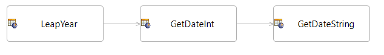
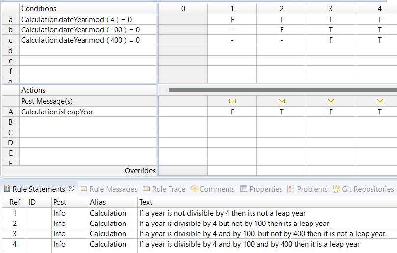
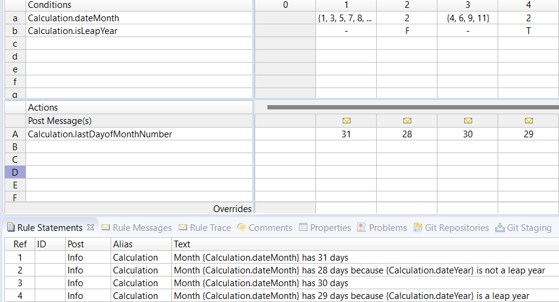
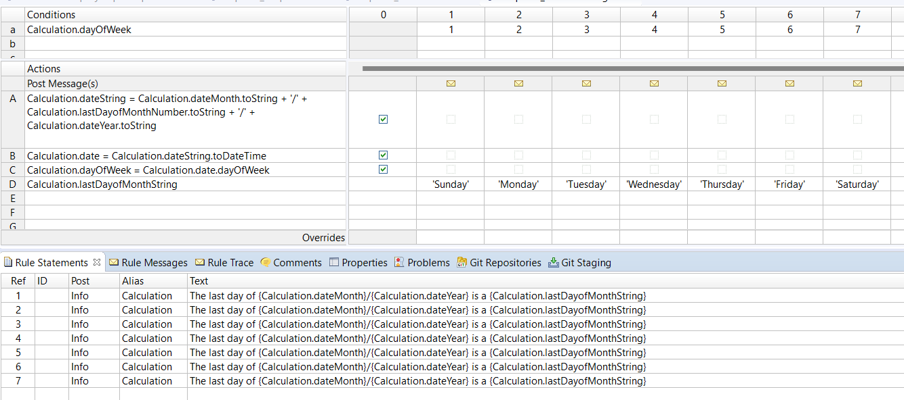

# How to Determine Leap Year

This rule model determines if a year is a leap year: 

This sheet determines the number of days in the month taking into consideration whether the years is a leap year (as determined by the previous rule sheet):

This sheet generates the string form of the date of the last day of the month by concatenating
the various components with the ‘+’ operator and also determines what day of the week it falls
on. It makes use of the operators: toString, dateStringToDateTime, toDateTime and dayOfWeek:

