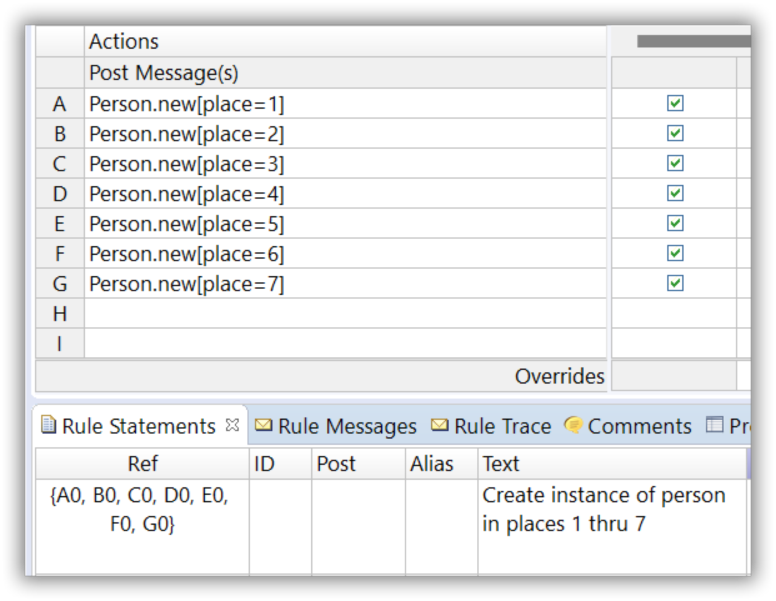
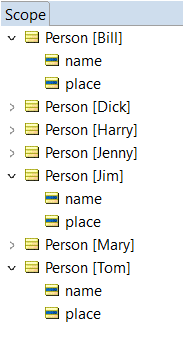
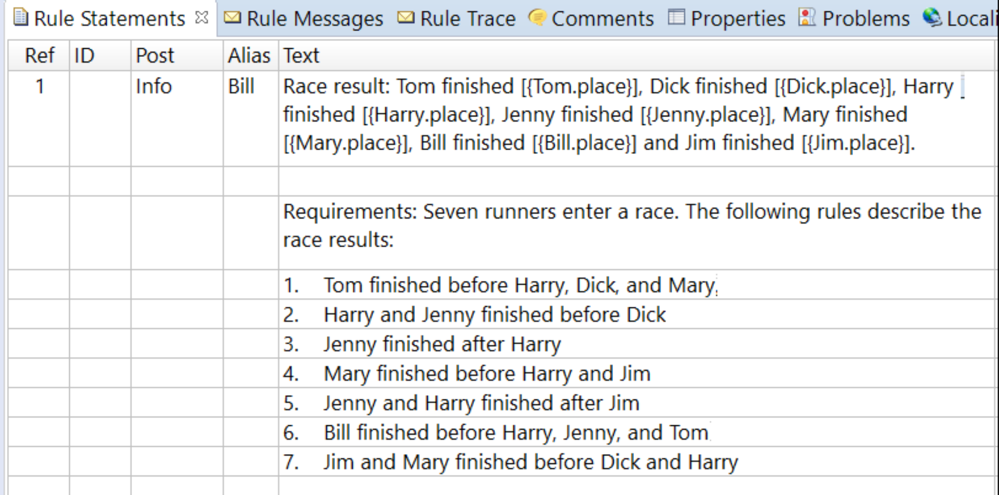
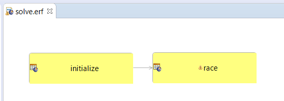
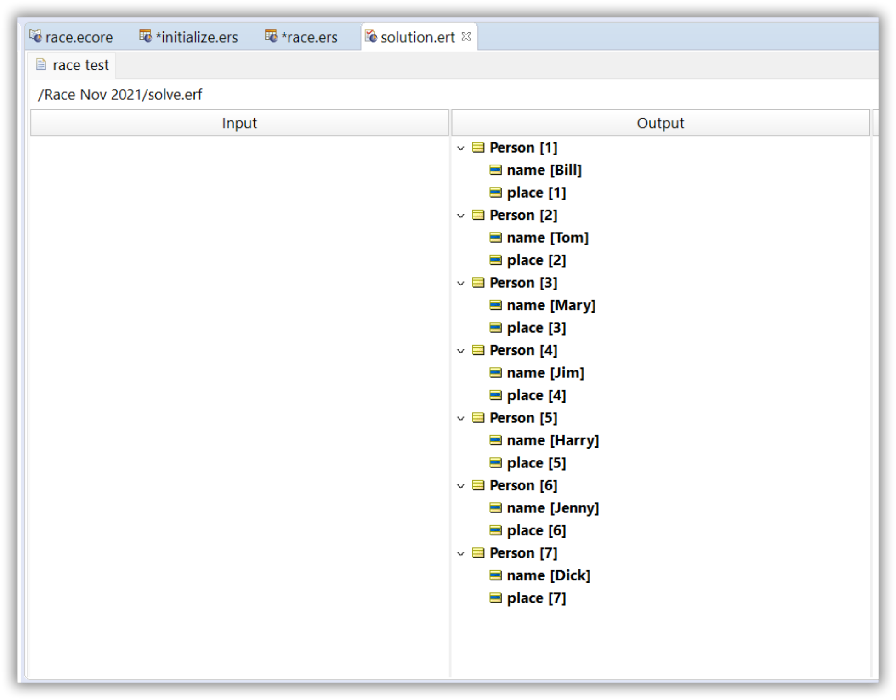

# Rule Authoring in Practice: ‘Off to the Races’

https://minhaskamal.github.io/DownGit/#/home?url=https://github.com/corticon/templates/blob/main/classic-templates/Who-Won-The-Race/Winner%20of%20the%20Race%20Word%20Problem.zip)

**Seven runners enter a race. The following rules describe the race results:**

1. Tom finished before Harry, Dick and Mary
2. Harry and Jenny finished before Dick
3. Jenny finished after Harry
4. Mary finished before Harry and Jim
5. Jenny and Harry finished after Jim
6. Bill finished before Harry, Jenny and Tom
7. Jim and Mary finished before Dick and Harry

**In what order did the runners finish the race?**

This puzzle is a classic constraint-based problem. The seven runners who run the race _could_
finish in any of the many sequences. In this race, the total number of possible finish sequences
is equal to 7! (7 factorial), or 7x6x5x4x3x2x1=5,040. That's a lot!

We also know that any given runner can finish in any place, from first to last. While the
constraints place additional limits on order in which the runners finish, we’re trying to visualize
our starting set of possibilities before we use the constraint rules to “narrow down” our
options.

Below, we’ll share the solution of one of this rule modeling challenge’s entrants:

Below is a small Vocabulary that contains everything needed to model this problem.

A `Person` entity allows us to talk about a collection of Person entities who make up the group
of racers who enter the race.

Then, each Person entity has a place and name attribute. This represents the fact that any Person
can finish in any of several different places.

We need to think about all place possibilities, then use rules to narrow them down to just a few -
specifically, those that satisfy the constraints. So, we need a Vocabulary that lets us visualize
and model these possibilities.

Now, let’s design a Rulesheet that fleshes out our set of possibilities. In other words, we want
to model rules that will give each `Person` in the race a set of all possible finishing places, first
through last.

So, let's create 7 `Person` instances with a place indication in Corticon working memory through
an initialization rulesheet (initialize.ers).

Of course, we could also provide this in our input request to the rules.

The Person entity instances are created in a set of non-conditional rules using the `new` operator.

You can find this operator in the Corticon operator tree under Entity/Association Operators.
Learn more about this operator and its syntax here.

Our next step would be to assign the proper name to each instance based on our set of rules.
This we’ll do in the next rulesheet (race.ers). It is too large to fit on the page, so we’ll break it up
into several screenshots. Let’s start with the scope section.

Remember we created 7 instances of the `Person` entity  in the initialization rulesheet, reflecting all
possible race finishing positions for a Person entity. The Corticon scope section allows us to
define a set of named aliases for each Person entity. Effectively, this means that our initial entity
instances are replicated in working memory for each race participant. This is pretty powerful as
we can now start to build rules for all these named (aliased) entity instances.

For convenience sake and readability, we have used a condition row to refer to our original
rules. This generates a little warning message on the rulesheet, which you can ignore. As you
can see, each combination of conditions must be true to generate a satisfying result for the
race.

Condition/Action column 1 is the combination of all the requirements from the puzzle’s
definition. When the first requirement states “Tom finished before Harry, Dick and Mary”, we
interpret this to mean (in the context of our Vocabulary) that Tom’s place number is less than
Harry’s and Dick’s and Mary’s. This logic is modeled as Condition rows b,c, and d. Notice that these
conditions, and all the others, are AND’ed together. In other words, only a finishing sequence
that satisfies all the requirements at the same time can be considered a solution.

It’s only when ALL rule conditions are satisfied that we assign the name attribute to the proper
Person entity instance in the Actions pane.

The Action simply posts the following message, which has been entered as Rule Statement 1:

So, any finish sequence that satisfies all the Conditions of the rule will be detailed in the posted
Rule Statement. Let’s try a Test and see what happens.

First, we build a simple ruleflow that includes the two rulesheets.

The Input Testsheet is empty. We don’t need to supply data in the input as the initialization
rulesheet sets up the 7 `Person` entity instances, also known by our alias as the racers.

The Output pane in the test sheet shows each racer (`Person`) identified by a place attribute,
numbered 1 through 7. This is the result of the race rulesheet executing.

The answer to the puzzle is contained in the posted Rule Statement, below:

In this case, only one finish sequence of the 5,040 possible satisfy all the constraints, so only
one Rule Statement is posted.

The full solution can be downloaded from the Corticon GitHub repository.

