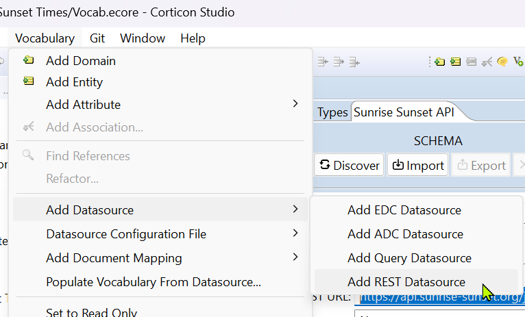
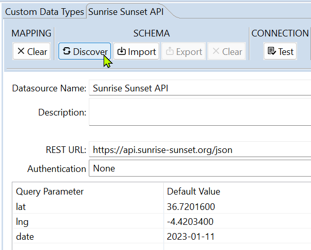
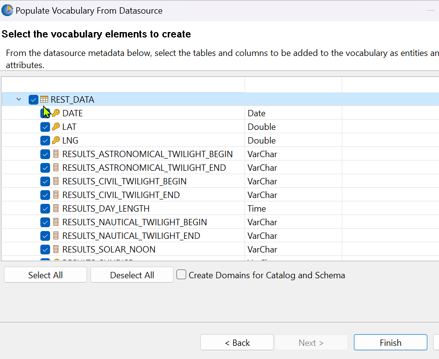
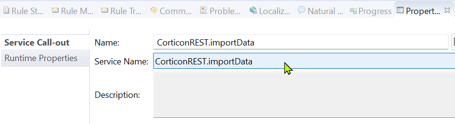
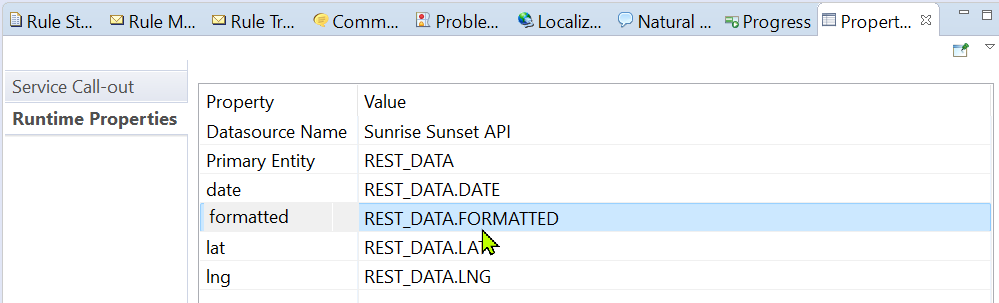
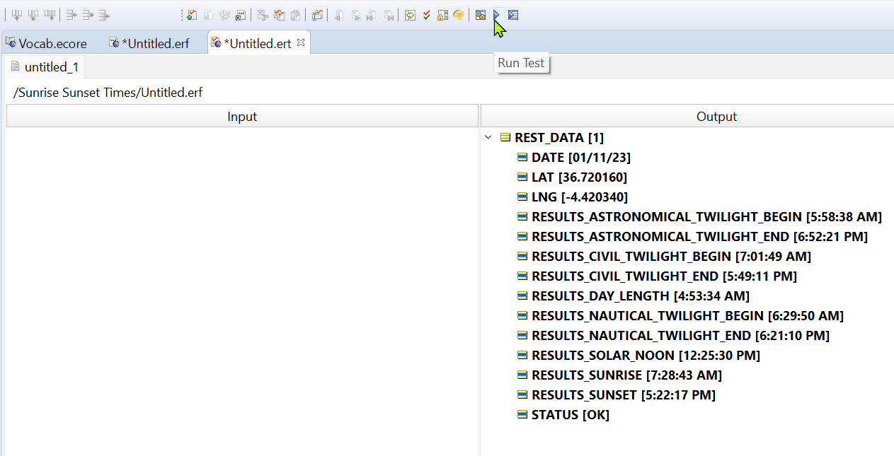

Use data from external REST API in rules

---
[Download Rule Assets](https://github.com/corticon/accelerators/raw/main/docs/classic-templates/project-zips/Sunrise%20Sunset%20REST%20API.zip)

---
Corticon's REST connectivity allows you to access data via REST services such that rule payloads can be enriched with REST data similar to database data. Corticon uses the [Progress Data Direct Autonomous REST Connector](https://www.progress.com/connectors/autonomous-rest-connector) to provide support for REST data integration. This allows you to access a REST service similar to the way you access a database. 

This simple sample illustrates the functionality using the free API provided at https://sunrise-sunset.org/. It was built in just a few steps:

The rule vocabulary has a REST datasource configured by navigating into the Rule Vocabulary menu -> Add Datasource -> Add REST Datasource.

From there, when you copy a REST endpoint such as: 
https://api.sunrise-sunset.org/json?lat=36.7201600&lng=-4.4203400&date=2023-01-11 
into the REST URL field, the query parameters are automatically parsed out. 

When you click 'discover' it translates the JSON into a relational structure that Corticon can map to a vocabulary. 

To generate a vocabulary directly from this data structure, navigate to Vocabulary -> Populate Vocabulary from Datasource -> Next -> select all options and click finish.

Next, we add a specific node in a ruleflow at the point which we would like Corticon to execute this REST query. For now, we're merely trying to retrieve the data based upon some inputs, so we just add a Service Callout to the ruleflow, single click the callout, then configure the behavior in the Properties window. 

Using the 'import data' option, the query will substitute the default query parameters with users provided ones (if any are provided). If none are provided, the default ones are used, which we can see by running a ruletest against this ruleflow with no payload:

