Implement rules to apply promotions to a shopping cart.

In this tutorial, you learn how to use some of Corticon Studio’s more complex and powerful functions, including:

-   Building a **Vocabulary** with associations—Associations enable you to define relationships between entities. For example, many items can be associated with one shopping cart.
-   Using **Scope** and **Aliases** in rules—Scope and Aliases enable you to define rules that apply to an entity in relation to another entity. For example, if the total price of items in a customer’s shopping cart exceeds $100, give the customer a coupon.
-   Creating **action-only** rules—Rules in column 0 of a Rulesheet. They are non-conditional rules: the rules always fire so the action always applies. For example, calculate the total price of items in a shopping cart.
-   Using **equations** in rules.
-   Using **Collections** and **Collection operators**—Collections enable you to define rules that apply to a group of entity instances. For example, check to see if any items in a Shopping Cart are from the Liquor department.
-   Using **Filters** in rules—Filters enable you to filter out data, so only entities that pass the filter criteria are evaluated by rules in a Rulesheet.
-   Using a variety of **attribute and entity operators** in rules.
-   Sequencing Rulesheets in a **Ruleflow**.
-   **Embedding attributes within rule statements**—This feature enables you to retrieve the value of an attribute instead of hard-coding it in a rule message. For example, `“${ShoppingCart.cashBackEarned} bonus earned today”`.
-   **Testing** at the Ruleflow level.

Just like the Basic Tutorial, you follow the rule development lifecycle: discover, model, and test rules. Because this tutorial focuses on teaching you how to build complex rule models, the Analyze phase is skipped to save time.

This tutorial is designed for hands-on use. Progress recommends that you follow along in Corticon Studio, using the provided instructions and illustrations. If you haven’t installed Corticon Studio yet, install it now. [Click here](https://www.progress.com/trial-corticon) for instructions on installing Corticon Studio.

## The business problem

The Advanced Tutorial uses a business case to build a rule model in Corticon Studio. The business case is as follows:

The owner of a chain of grocery stores wants to build and install a system of business rule-based smart cash registers in all its branches. Some branches are large supermarkets, and some are smaller convenience stores, which sell gasoline and other essentials.

In addition to the minimum cash register functionality (adding up the price of items in a customer’s shopping cart), the new system should also be able to apply:

-   Promotional rules
-   Loyalty program rules
-   Coupon generation rules
-   Special warning rules that alert the cashier to take certain actions

Because every item in every store has a bar-coded label, the system’s scanner can determine complete information about each item, such as which department an item comes from.

To foster customer loyalty and drive additional sales, a Preferred Shopper program launches in conjunction with the installation of the new business rule-based cash registers. Shoppers who enroll in the program are issued Preferred Shopper membership cards (one card per household) to present to the cashier at check-out time.

Benefits of the Preferred Shopper program include:

-   2% cash back on all purchases at any branch:
    -   The Preferred Shopper account tracks the accumulated cash back and allows the shopper to apply it to the total amount at any visit.
    -   The cashier asks a Preferred Shopper if they would like to apply their cash back balance to their current purchase.
    -   After which, the cumulative cash back total maintained by the system is reset to zero.
    -   The accumulation of cash back begins anew with the customer’s next purchase.
-   Eligibility for special promotions and coupons:
    -   A coupon for one free balloon for every item purchased from the Floral department. This coupon has no expiration date.
    -   A coupon for $2 off on their next purchase when 3 or more soda or juice items are purchased in a single visit. This coupon has an expiration date of one year from the date of issue.
    -   A coupon for 10% off their next gasoline purchase at any chain-owned convenience store with any purchase of $75 or more. This coupon has an expiration date of three months from the date of issue.

Additionally, in compliance with local, state, and federal laws, the chain needs to ensure that all purchases of liquor (any items from the Liquor department) are made by shoppers 21 or older. The new system should display an alert or warning on the cashier’s screen, prompting them to check the customer’s ID.

Discovering business rules involves two things:

-   Identifying the terms to be included in the Vocabulary
-   Identifying the business rules

Let’s start with the Vocabulary.

### Identify Vocabulary terms and associations

To get started, you review the business problem and start compiling terms that need to be included in the Vocabulary. You can then identify the key entities and the assumptions about each entity:

-   **Customer**:
    -   A Customer has a **Name**.
    -   A Customer uses a **Shopping Cart** to carry **Items**.
    -   A Customer may be a **Preferred Shopper** and have a **Preferred Shopper** account that is identified by swiping their Preferred Card at checkout.
    -   A Preferred Shopper account has a **Card Number**.
    -   A Preferred Shopper account holds a **Cash-Back Balance**.
    -   One Preferred Shopper account may be used by anyone in a family.
-   **Item**:
    -   Each Item has a **Name**.
    -   An Item has a **Price**.
    -   An Item has a **Bar-coded** label.
    -   An Item has a **Department** embedded in the Bar-coded label.
-   **Shopping Cart**:
    -   Shopping Carts contain the **Items** that a Customer purchases during each visit.
    -   Each Shopping Cart has a **Total Amount**.
    -   If the Customer has a Preferred Shopper account, a **Cash-Back Bonus** is calculated using the Shopping Cart’s total amount and is deducted from the total amount upon customer request.
-   **Coupon**:
    -   Coupons are issued to shoppers based on promotions.
    -   A Coupon has a **Description**.
    -   A Coupon has an **Issue Date**.
    -   A Coupon has an **Expiration Date**.

Based on these assumptions, you can derive the attributes for each entity in the Vocabulary. Attributes are properties or characteristics that distinguish one instance of an entity from another. For example, each item has attributes like name, price, and bar code. Such attribute values make each item unique.

This table lists the attributes for each entity along with their data type and attribute mode:


The mode of an attribute can be Base or Transient. **Base** attribute values are either sent to the rule model from a client application, returned to a client application from the rule model, or both. **Transient** attributes are only used within the rule model, and their values are assigned or derived by rules, but not sent to a client application. For example, the **cashBackEarned** attribute is a Transient attribute that is used to update the value of the **cumulativeCashBack** attribute, which is a Base attribute.

Next, let’s identify the associations for the Vocabulary. An association defines the relationship between two entities. It can be one-to-one, one-to-many, many-to-one, or many-to-many. In this grocery store business problem, you have the following associations:

-   Many Customers (members of a family) can be associated with one PreferredAccount (many-to-one).
-   One Customer can be associated with many ShoppingCarts over multiple visits (one-to-many).
-   One ShoppingCart can be associated with many Items (one-to-many).

To make these relationships clear, you create a diagram of the associations. Creating a diagram is especially useful when you have a large or complex Vocabulary with many associations. Here is the diagram of entities and associations for this business problem:

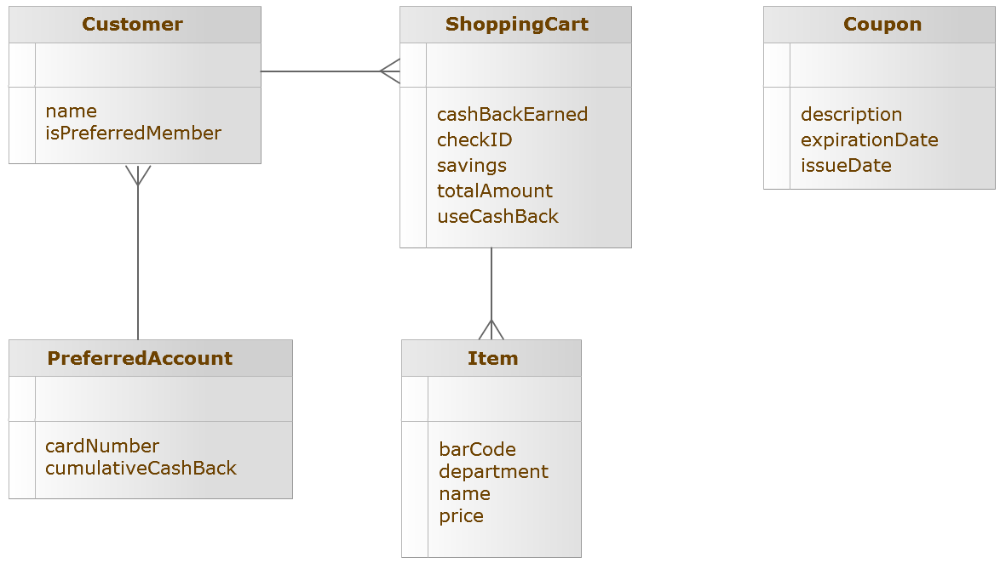

In this diagram, the connectors between entities show the kind of relationship. For example, Customer has a one-to-many association with ShoppingCart.

### Identify the business rules

Next, let’s identify specific business rules. At a high level, this is the basic process followed by every customer making purchases at a store:


Though this process may involve several steps, you as rule modelers should be most concerned with those steps where decisions are made. In this case, the **Checkout** step contains the rule-based decisions that are built into the store’s cash registers.

Let’s drill down into the **Checkout** step and define more detail about the rules inside. If you identify a natural sequence or flow of logical substeps within a single decision step, then you should:

1.  Organize the substeps using separate Rulesheets.
2.  Combine the Rulesheets into a Ruleflow

For the **Checkout** step, the following three substeps are identified. You create a Rulesheet for each of these substeps and combine them into a Ruleflow.

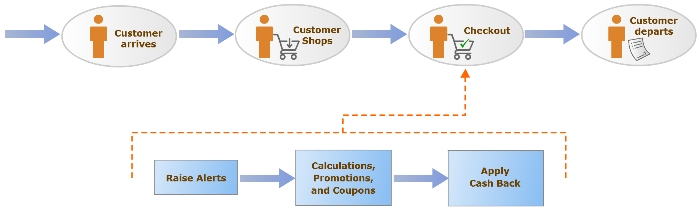

Next, let’s look at the business rules that you need to model for each substep:


Now, let’s implement the Vocabulary in Corticon Studio. To begin, launch Corticon Studio and create a Rule Project:

1.  On the **Start** menu, select **Progress > Corticon Studio**.
2.  In the **Workspace Launcher** dialog box, retain the default workspace and click **OK**. Corticon Studio opens.
3.  Select **File > New > Rule Project**.

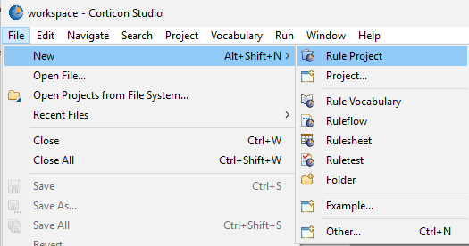

4. In the **New Corticon Project** window, in the **Project name** field, type MyAdvancedTutorial, and click **Finish**.

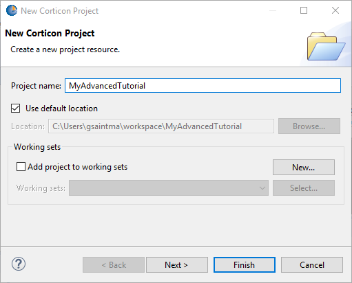

## Create the Vocabulary

To create a Vocabulary file:

1. Right-click MyAdvancedTutorial and select New > Rule Vocabulary.

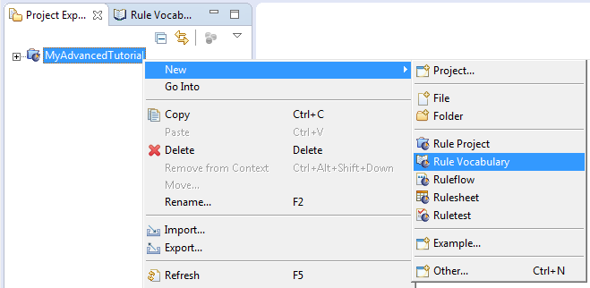

2. In the Create a New Vocabulary window, in the File name field, type groceryStore, and click Finish

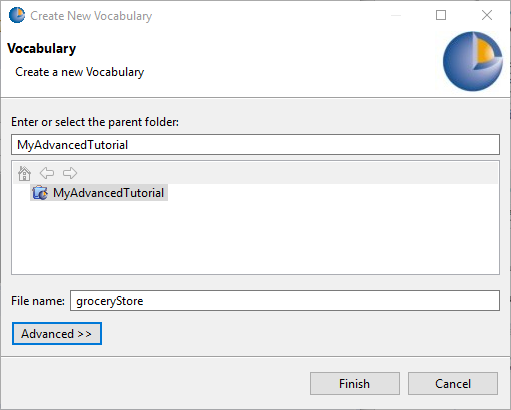

The Vocabulary opens under the rule project MyAdvancedTutorial.

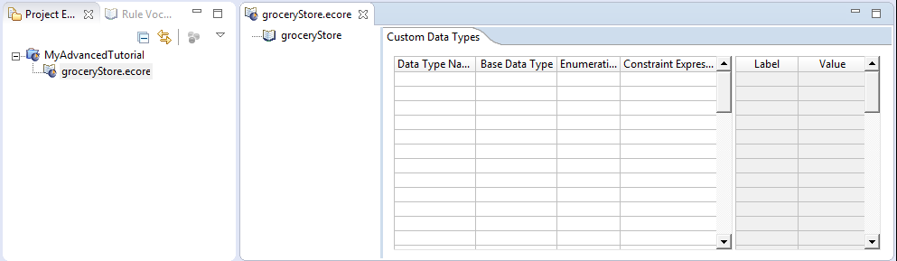

### Add Entities

Now, let’s add the entities (Customer, PreferredAccount, Item, ShoppingCart, Coupon):

1.  In the **Vocabulary editor** , right-click **groceryStore** and select **Add Entity**.

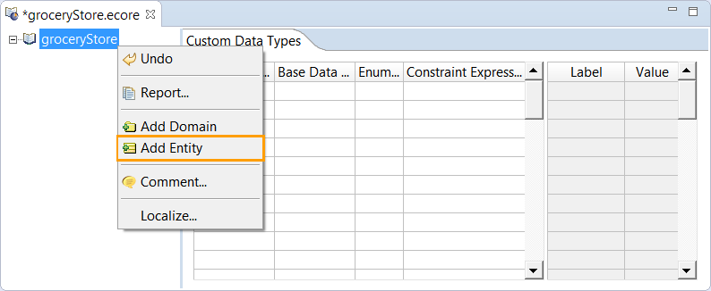

2. Rename this entity by typing Customer over the default name.
 
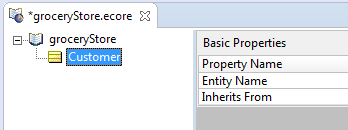

3. Repeat these steps to add the remaining entities. The result looks like this:

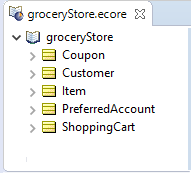

### Add Attributes

To add the attributes, start by adding attributes for the **Customer** entity based on this table:

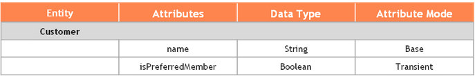

[Download Rule Assets](https://minhaskamal.github.io/DownGit/#/home?url=https://github.com/corticon/templates/blob/main/classic-templates/Grocery-Cart/Shopping%20Cart.zip)

1. Right-click **Customer** and select **Add Attribute**, and then choose **String**.

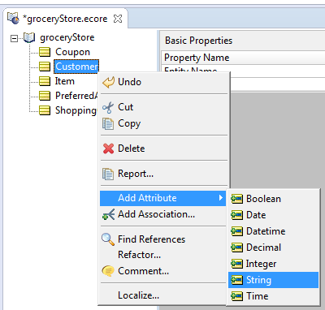

:::info
The Data Type Time is not available in Corticon.js.
:::

2. Rename this attribute by typing `name` over the default name.
   
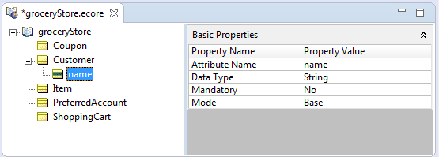

3. Right-click **Customer**, select **Add Attribute**, and then choose **Boolean**

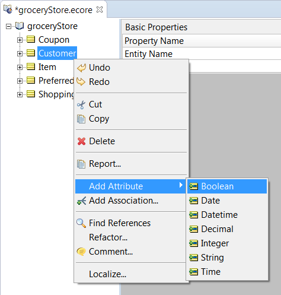

4. Type `isPreferredMember` over the default attribute name and enter.

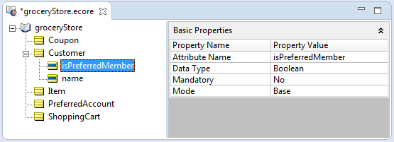

5. In the **Mode** drop-down list, select **Transient**.


6. Add attributes for the rest of the entities based on this table: 
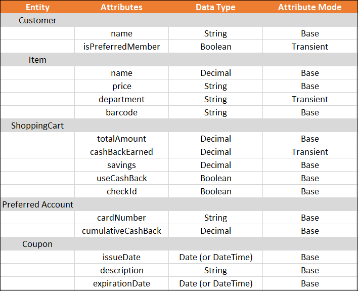

After adding all the attributes, the Vocabulary looks like this:

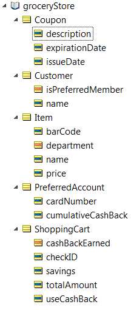

### Add Associations

To create associations between the entities, start with the association between Customer and PreferredAccount. This is a many-to-one association.

1.  Right-click **Customer** and select **Add Association**.

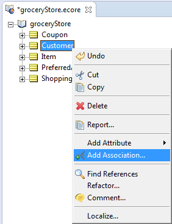

2. In the **Association** dialog box:
   * In the **Source Entity** group, select Customer with the Source **Many** and **Mandatory**.
   * In the **Target Entity Name** group, select **PreferredAccount** with the Target **One**.
   * Click **OK**.

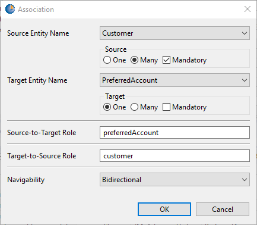

The association appears as shown here. 

3. Notice that the association appears as many-to-one () under Customer and one-to-many () under PreferredAccount.

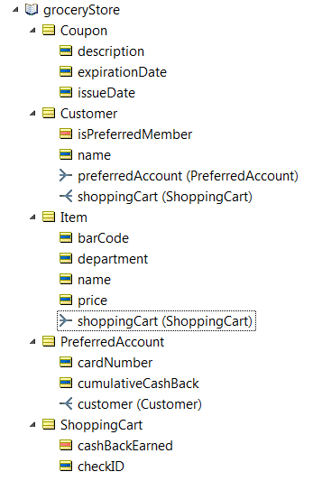

4.  Similarly, add associations between:
-   Customer and ShoppingCart (one-to-many)
-   Item and ShoppingCart (many-to-one)The final output will look like this.

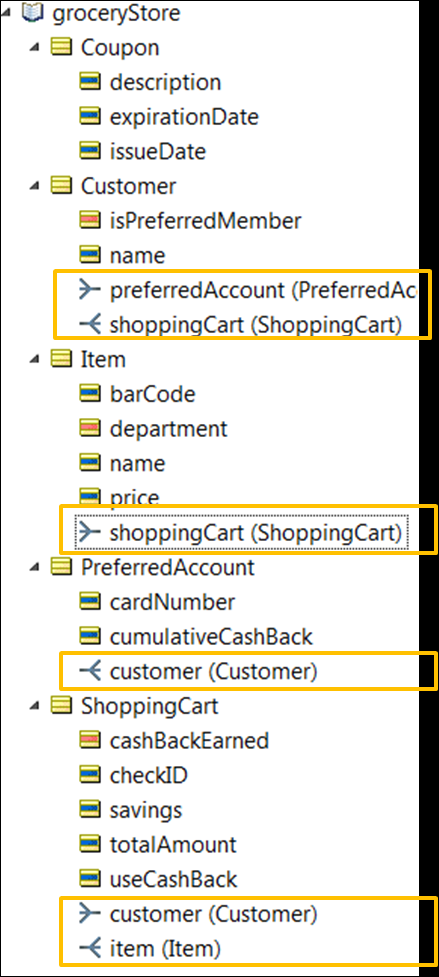

Each association has an association role name. For example, the association between Customer and PreferredAccount has the name **preferredAccount**. Note that the opposite association between PreferredAccount and Customer has the role name **customer**. A role name helps describe or clarify the relationship of an entity with another entity.

You can change the role name for an association to make it more meaningful. In our example, let’s change the role name for the association between Customer and PreferredAccount to **preferredCard** by double-clicking the association under Customer,and typing **preferredCard** over the default value.

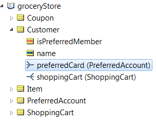

### Model the first Rulesheet

With the Vocabulary ready, you can now focus on modeling the rules. Let’s begin with the first Rulesheet, which models the rules in the Raise Alerts substep.


Before building or modeling anything, you should think about how to approach this part of the problem.

The business rule identified for the Raise Alerts substep examines all items in a customer’s shopping cart and determines which items (if any) come from the Liquor department.

Each **Item** has a barcode. The department code occupies the 4<sup class="ph sup">th</sup> through 6<sup class="ph sup">th</sup> characters of the barcode. Let’s assume that the department code for liquor is `291`. So if an item has `291` occupying the 4<sup class="ph sup">th</sup> through 6<sup class="ph sup">th</sup> characters of the barcode, the cashier must be alerted to check the customer’s identification.

Considering this scenario, define two rules in Corticon Studio:

1.  Determine the department code for every item in the shopping cart.
2.  Determine if any of the items come from the Liquor department and if so, the rule raises an alert of some kind.

It is normal t not always have a one-to-one correlation between the business rule defined in a business scenario and the corresponding rules modeled in Corticon Studio. A good guideline is to keep your individual rules relatively simple and let them work together to perform more complex logic defined by the business rules.

### Create the Rulesheet

1.  Before you start defining the rules, create a Rulesheet.
    
      
      
    
2.  Name the Rulesheet `checks`, and then click **Next**.  
      
    
3.  Select **groceryStore.ecore** as the Vocabulary.  
      
    
:::info
You named this Rulesheet **checks** as reminder of the overall organization—this Rulesheet performs any necessary checks and raises alerts as required.
:::
    
4.  Click **Finish**.

### Define rule scope

You need to choose the point of view in the Vocabulary that best represents the terms required by the rules themselves. This point of view, called the scope of the rule, changes from Rulesheet to Rulesheet.

Scope is a powerful and important concept. It determines which entity instances and attributes are evaluated and acted upon by a rule. For the first Rulesheet, define rules that act only on Items associated with a ShoppingCart, which in turn is associated with a Customer. Using Customer as the root entity and working with the associated ShoppingCart and its items makes sense because it is a Customer’s transaction that is processed by the Checkout step. It forms the scope of the rules in the Rulesheet.

  
  

To define the scope:

1.  Open the **Scope** pane of the Rulesheet by ensuring that **checks.ers** is open and active, and selecting **Rulesheet > Advanced View**.  
      
    The Scope pane opens in the Rulesheet.
2.  Drag the **Customer** entity from the Rule Vocabulary view and drop it into the **Scope** pane.  
      
    
3.  Drag **shoppingCart** from under **Customer** into the **Scope** pane.  
      
    
4.  To complete the scope, drag **item** from under **shoppingCart** and drop it into the **Scope** pane.  
      
    

Next, let’s enter an alias for a customer’s shopping cart and call it **currentCart** by double-clicking **shoppingCart** in the **Scope** pane and enter **currentCart**. From now on, when you model rules involving a customer’s shopping cart, use this alias to represent the perspective of a customer’s shopping cart.

  
  

Because a shopping cart can contain many items, let’s define another alias **items** that represents all the items in a customer’s shopping cart.

  
  

Assigning meaningful alias names is a good practice and using the plural form of item reminds us that the alias represents all the items in the customer’s shopping cart.

Using aliases is optional in many cases—they serve to simplify and shorten rule expressions. But in certain cases, using aliases is mandatory. For example, applying collection operators to sets or collections of data in rules requires the use of aliases. Because you work with the collection of items in a customer’s shopping cart a bit later, keep the **items** alias defined and ready.

Aliases always insert themselves automatically when terms are dragged from the **Scope** section or **Vocabulary** window to the Rulesheet. Because all Studio expressions are case-sensitive, to avoid errors, drag and drop terms instead of typing them manually.

### Model the first rule

To model the business rule for the Raise Alerts substep, create two rules in Corticon Studio in the checks Rulesheet:

-   Rule 1: Determine the department code for every item in the shopping cart.
-   Rule 2: Use the department code to determine if any of the items come from the Liquor department and if so, raise an alert.

Let’s start modeling the first rule—determining the department codes. You know an item’s department is identified by the 4<sup class="ph sup">th</sup> through 6<sup class="ph sup">th</sup> characters in its barcode. So using the **items** alias, let’s add an **action-only rule** in an **Actions** row of column **0** using the String operator **.substring** as shown.


:::info

 A preferred user language might use different separator symbols than those documented for decimal values, list ranges, and dates. Here, you might need to write `substring(4;6)`.

:::
  
  

The expression **items.department=items.barCode.substring(4,6)** extracts the characters from positions 4 to 6 in the barcode string and assigns the substring to `items.department`. The checkbox in the corresponding cell of column **0** indicates that this is an action-only rule, which fires whenever the Rulesheet receives any data. Action-only rules fire first in the Rulesheet. In this example, it is useful because you need to extract the department code before identifying whether any items come from the Liquor department.

Because the alias **items** represents the collection of all items associated with a customer’s shopping cart, this rule evaluates and processes every item in a customer’s shopping cart, extracts each department code, and then assigns that code to the item’s **department** attribute. This iteration is a natural behavior of the rule engine: it automatically processes all data that matches the rule’s scope.

Notice that when you dragged the terms **barcode** and **department** from the Vocabulary to the **Action** row, they were automatically added to the **Scope** pane. Over time, the **Scope** pane becomes a reduced version of the Vocabulary, containing only those terms used by the rules in that Rulesheet.

Save the Rulesheet.

### Test the first rule

1.  To test the first rule, create a Ruletest.    
  
    
2.  Name the Ruletest **checks**, and then choose the test subject **checks.ers**.
3.  In the **Input** pane of the Ruletest, define a customer with an associated shopping cart containing two items, one of which is from the Liquor department.
4.  Drag the **Customer** entity, and drop it into the Input pane. Then, drop **shoppingCart** (under Customer) onto the Customer entity:
    
      
  
    
Then drag and drop **item** (under shoppingCart) onto the shoppingCart entity twice.
    
>    Note: You must drop the items from the Vocabulary into the **Input** pane of the Ruletest in the indicated order so that you can duplicate the scope of the rule which that processes this data.
    
5.  When finished, enter test data as shown.
    
Note: A preferred user language might use different separator symbols than those documented for decimal values, list ranges, and dates. In that case, you might need to write the price of Miller Beer as:
    
    ```
    6,990000
    ```
    
      
      
    
    As you can see, one of the items is from the liquor department (remember that the department code for Liquor is 291, which occupies characters 4 through 6 in the barcode).
6.  Finally, execute the Ruletest. The output should look like this:  
      
    

The first rule has worked as expected. Characters 4-6 have been successfully parsed from each item’s **barCode** and assigned to its **department** attribute.

By modeling a rule and then immediately testing it, you have demonstrated a good Studio modeling practice. Testing right away helps expose flaws in the rules as you go along.

## Model the second rule

Now that department codes are readily available for every item in a customer’s shopping cart, you need to determine if any came from the Liquor department.

It requires you to look inside the collection of items to see if an item exists with `department = '291'`. You only need one check ID alert per checkout transaction, this is a job for a collection operator.

A collection operator, because it acts on collections, evaluates once per collection and not once per item, as the previous rule did. You only need one check ID alert if the shopping cart contains any liquor. You do not want multiple alerts if the shopping cart contains several liquor items.

Using the **items** alias, let’s add a Condition for the second rule that determines if any liquor items exist in the customer’s shopping cart. To add this condition, use the Collection operator **→exists**. The **→exists** operator checks if a specific value exists for an attribute in the entity instances in the collection. In this case the collection is **items**. So the condition expression is items->exists(department='291').

Note: Always use plain single-quotation marks to specify a text string.

Then, define an **Action** for the second rule to assign a value of `true` to the shopping cart’s **checkID** attribute, if any are found. (Here, the assumption is that the checkID term will act as the alerting mechanism to signal the cashier that an ID check is required during this checkout transaction.)

The second rule looks like this:

  
  

As mentioned earlier, using aliases to represent collections is mandatory when collection operators (like **→exists**) are used.

Add rule statements for each rule as shown:

  
  

## Test the second rule

Now, let’s re-run the same Ruletest as before:

  
  

The **Condition** and **Action** rule has worked as expected. A customer’s shopping cart containing an item from the Liquor department has been identified, and the **checkID** attribute is set to `true` to alert the cashier to check the customer’s ID. Notice that the business rule statement has also been posted in the **Message** box. Often, a simple message is all you need to raise an alert or warning.

Note: Ordinarily, you would check for Conflicts and Completeness before testing with data. But because this tutorial focuses on advanced rule modeling features, the Analyze phase of the rule development lifecycle is skipped.

## Add more rules to the checks Rulesheet

You have implemented two rules representing the first business rule in the checks Rulesheet. Let's use this Rulesheet to model two more rules:

-   Check if a customer has a preferred account
-   Add the total price of items in a shopping cart

You use the output of the first rule in the next Rulesheet to filter out customers who do not have preferred accounts, since that Rulesheet contains promotional rules that apply only to preferred account holders.

The second rule, which calculates total price, must be included in the first Rulesheet, because the second Rulesheet filters out customers who do not have preferred accounts, whereas you want to calculate the total price for every customer.

## Check if a customer has a preferred account

Any customer who has a **Preferred Account** has an associated preferredCard. So, let’s begin by defining the scope. Drag **preferredCard** under **Customer** in the Vocabulary to the **Scope** pane. Give it the Alias **account**.

  
  

The account alias represents a potential collection, where a customer has a **Preferred Card** only if they have a **Preferred Account**. The many-to-one nature of the association means a customer can have at most one account, and other customers (within the same family) share the same **Preferred Account**. For customers who do not have **Preferred Accounts**, the alias **account** represents an empty collection (the collection contains no elements).

The **→notEmpty** collection operator checks a collection for the existence of at least one element in the set. You can use this operator to check if a customer has a preferred card. Because **→notEmpty** acts on a collection, the **account** alias must be used with it.

Model a Boolean condition in row **b** in the **Conditions** pane that uses the **→notEmpty** collection operator as shown. If the **account** alias is not empty, the customer has a preferred account.

  
  

Let’s add an action to this rule that assigns the value of `true` to the **isPreferredMember** attribute (from the **Customer** entity) and posts an informational message, as shown. Recall that **isPreferredMember** is a transient attribute whose value is only used in the rules.

  
  

Now, whenever you want to know if a customer is a preferred customer, simply refer to the value of the **isPreferredMember** attribute. This method of flagging an entity with a Boolean attribute is convenient when modeling larger Ruleflows. The value of the flag, like all attributes, carries over to other rules in this and other Rulesheets in the same Ruleflow.

Now, let’s test this rule. For this rule to detect the presence of a preferred card account associated with a customer, you need to provide the appropriate test data. Drag the **preferredCard** entity and drop it onto the **Customer** entity in the Ruletest **Input**.

Note: If you do not see the indented structure identical to the following image, delete the entity and try again.

  
  

## Run the Ruletest

The Output shows the results.

  
  

Notice that the **isPreferredMember** transient attribute has been inserted and assigned the value `true`, and that an informational message has been posted. Our rule has worked as expected.

## Calculate the total price of items in a shopping cart

Finally, you add one more action-only rule to calculate the **totalAmount** of all items in a customer’s shopping cart by using the collection operator **→sum** as shown. This operator adds up the price attributes of all elements in the **items** alias, and then assigns that value to the **totalAmount** attribute.

Now, add a rule statement for this rule. Adding rule statements is good practice, even if you do not post them as messages.

  
  

Finally, let’s test this rule. In the **Input** pane of the Ruletest there is a customer with two items in their shopping cart. Let’s see if the last rule calculates the **totalAmount** for the items in the Customer’s shopping cart.

  
  

## Run the Ruletest

  
  

The following happened in this Ruletest:

1.  The rules to determine if an ID check is required and if the customer is a preferred card holder still work.
    
    Note: You should double-check cumulative test results to make sure nothing has broken along the way.
    
2.  The **totalAmount** attribute has returned a value of **8.98**, which is the correct sum of the prices of items 1 and 2, showing that the latest rule also works as expected.

You have now completed modeling and testing our first Rulesheet.