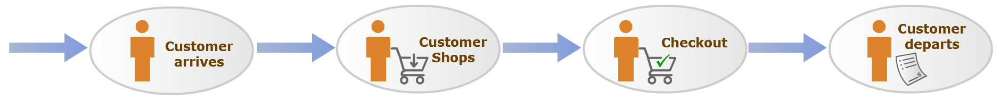
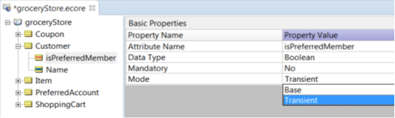

Implement rules to apply promotions to a shopping cart.

In this tutorial, you learn how to use some of Corticon Studio’s more complex and powerful functions, including:

-   Building a **Vocabulary** with associations—Associations enable you to define relationships between entities. For example, many items can be associated with one shopping cart.
-   Using **Scope** and **Aliases** in rules—Scope and Aliases enable you to define rules that apply to an entity in relation to another entity. For example, if the total price of items in a customer’s shopping cart exceeds $100, give the customer a coupon.
-   Creating **action-only** rules—Rules in column 0 of a Rulesheet. They are non-conditional rules: the rules always fire so the action always applies. For example, calculate the total price of items in a shopping cart.
-   Using **equations** in rules.
-   Using **Collections** and **Collection operators**—Collections enable you to define rules that apply to a group of entity instances. For example, check to see if any items in a Shopping Cart are from the Liquor department.
-   Using **Filters** in rules—Filters enable you to filter out data, so only entities that pass the filter criteria are evaluated by rules in a Rulesheet.
-   Using a variety of **attribute and entity operators** in rules.
-   Sequencing Rulesheets in a **Ruleflow**.
-   **Embedding attributes within rule statements**—This feature enables you to retrieve the value of an attribute instead of hard-coding it in a rule message. For example, `“${ShoppingCart.cashBackEarned} bonus earned today”`.
-   **Testing** at the Ruleflow level.

Just like the Basic Tutorial, you follow the rule development lifecycle: discover, model, and test rules. Because this tutorial focuses on teaching you how to build complex rule models, the Analyze phase is skipped to save time.

This tutorial is designed for hands-on use. Progress recommends that you follow along in Corticon Studio, using the provided instructions and illustrations. If you haven’t installed Corticon Studio yet, install it now. [Click here](https://www.progress.com/trial-corticon) for instructions on installing Corticon Studio.

## The business problem

The Advanced Tutorial uses a business case to build a rule model in Corticon Studio. The business case is as follows:

The owner of a chain of grocery stores wants to build and install a system of business rule-based smart cash registers in all its branches. Some branches are large supermarkets, and some are smaller convenience stores, which sell gasoline and other essentials.

In addition to the minimum cash register functionality (adding up the price of items in a customer’s shopping cart), the new system should also be able to apply:

-   Promotional rules
-   Loyalty program rules
-   Coupon generation rules
-   Special warning rules that alert the cashier to take certain actions

Because every item in every store has a bar-coded label, the system’s scanner can determine complete information about each item, such as which department an item comes from.

To foster customer loyalty and drive additional sales, a Preferred Shopper program launches in conjunction with the installation of the new business rule-based cash registers. Shoppers who enroll in the program are issued Preferred Shopper membership cards (one card per household) to present to the cashier at check-out time.

Benefits of the Preferred Shopper program include:

-   2% cash back on all purchases at any branch:
    -   The Preferred Shopper account tracks the accumulated cash back and allows the shopper to apply it to the total amount at any visit.
    -   The cashier asks a Preferred Shopper if they would like to apply their cash back balance to their current purchase.
    -   After which, the cumulative cash back total maintained by the system is reset to zero.
    -   The accumulation of cash back begins anew with the customer’s next purchase.
-   Eligibility for special promotions and coupons:
    -   A coupon for one free balloon for every item purchased from the Floral department. This coupon has no expiration date.
    -   A coupon for $2 off on their next purchase when 3 or more soda or juice items are purchased in a single visit. This coupon has an expiration date of one year from the date of issue.
    -   A coupon for 10% off their next gasoline purchase at any chain-owned convenience store with any purchase of $75 or more. This coupon has an expiration date of three months from the date of issue.

Additionally, in compliance with local, state, and federal laws, the chain needs to ensure that all purchases of liquor (any items from the Liquor department) are made by shoppers 21 or older. The new system should display an alert or warning on the cashier’s screen, prompting them to check the customer’s ID.

Discovering business rules involves two things:

-   Identifying the terms to be included in the Vocabulary
-   Identifying the business rules

Let’s start with the Vocabulary.

### Identify Vocabulary terms and associations

To get started, you review the business problem and start compiling terms that need to be included in the Vocabulary. You can then identify the key entities and the assumptions about each entity:

-   **Customer**:
    -   A Customer has a **Name**.
    -   A Customer uses a **Shopping Cart** to carry **Items**.
    -   A Customer may be a **Preferred Shopper** and have a **Preferred Shopper** account that is identified by swiping their Preferred Card at checkout.
    -   A Preferred Shopper account has a **Card Number**.
    -   A Preferred Shopper account holds a **Cash-Back Balance**.
    -   One Preferred Shopper account may be used by anyone in a family.
-   **Item**:
    -   Each Item has a **Name**.
    -   An Item has a **Price**.
    -   An Item has a **Bar-coded** label.
    -   An Item has a **Department** embedded in the Bar-coded label.
-   **Shopping Cart**:
    -   Shopping Carts contain the **Items** that a Customer purchases during each visit.
    -   Each Shopping Cart has a **Total Amount**.
    -   If the Customer has a Preferred Shopper account, a **Cash-Back Bonus** is calculated using the Shopping Cart’s total amount and is deducted from the total amount upon customer request.
-   **Coupon**:
    -   Coupons are issued to shoppers based on promotions.
    -   A Coupon has a **Description**.
    -   A Coupon has an **Issue Date**.
    -   A Coupon has an **Expiration Date**.

Based on these assumptions, you can derive the attributes for each entity in the Vocabulary. Attributes are properties or characteristics that distinguish one instance of an entity from another. For example, each item has attributes like name, price, and bar code. Such attribute values make each item unique.

This table lists the attributes for each entity along with their data type and attribute mode:


The mode of an attribute can be Base or Transient. **Base** attribute values are either sent to the rule model from a client application, returned to a client application from the rule model, or both. **Transient** attributes are only used within the rule model, and their values are assigned or derived by rules, but not sent to a client application. For example, the **cashBackEarned** attribute is a Transient attribute that is used to update the value of the **cumulativeCashBack** attribute, which is a Base attribute.

Next, let’s identify the associations for the Vocabulary. An association defines the relationship between two entities. It can be one-to-one, one-to-many, many-to-one, or many-to-many. In this grocery store business problem, you have the following associations:

-   Many Customers (members of a family) can be associated with one PreferredAccount (many-to-one).
-   One Customer can be associated with many ShoppingCarts over multiple visits (one-to-many).
-   One ShoppingCart can be associated with many Items (one-to-many).

To make these relationships clear, you create a diagram of the associations. Creating a diagram is especially useful when you have a large or complex Vocabulary with many associations. Here is the diagram of entities and associations for this business problem:


In this diagram, the connectors between entities show the kind of relationship. For example, Customer has a one-to-many association with ShoppingCart.

### Identify the business rules

Next, let’s identify specific business rules. At a high level, this is the basic process followed by every customer making purchases at a store:



Though this process may involve several steps, you as rule modelers should be most concerned with those steps where decisions are made. In this case, the **Checkout** step contains the rule-based decisions that are built into the store’s cash registers.

Let’s drill down into the **Checkout** step and define more detail about the rules inside. If you identify a natural sequence or flow of logical substeps within a single decision step, then you should:

1.  Organize the substeps using separate Rulesheets.
2.  Combine the Rulesheets into a Ruleflow

For the **Checkout** step, the following three substeps are identified. You create a Rulesheet for each of these substeps and combine them into a Ruleflow.


Next, let’s look at the business rules that you need to model for each substep:


Now, let’s implement the Vocabulary in Corticon Studio. To begin, launch Corticon Studio and create a Rule Project:

1.  On the **Start** menu, select **Progress > Corticon Studio**.
2.  In the **Workspace Launcher** dialog box, retain the default workspace and click **OK**. Corticon Studio opens.
3.  Select **File > New > Rule Project**.


4. In the **New Corticon Project** window, in the **Project name** field, type MyAdvancedTutorial, and click **Finish**.


## Create the Vocabulary

To create a Vocabulary file:

1. Right-click MyAdvancedTutorial and select New > Rule Vocabulary.


2. In the Create a New Vocabulary window, in the File name field, type groceryStore, and click Finish


The Vocabulary opens under the rule project MyAdvancedTutorial.


### Add Entities

Now, let’s add the entities (Customer, PreferredAccount, Item, ShoppingCart, Coupon):

1.  In the **Vocabulary editor** , right-click **groceryStore** and select **Add Entity**.


2. Rename this entity by typing Customer over the default name.
 


3. Repeat these steps to add the remaining entities. The result looks like this:


### Add Attributes

To add the attributes, start by adding attributes for the **Customer** entity based on this table:


[Download Rule Assets](https://minhaskamal.github.io/DownGit/#/home?url=https://github.com/corticon/templates/blob/main/classic-templates/Grocery-Cart/Shopping%20Cart.zip)

1. Right-click **Customer** and select **Add Attribute**, and then choose **String**.


:::info
The Data Type Time is not available in Corticon.js.
:::

2. Rename this attribute by typing `name` over the default name.
   


3. Right-click **Customer**, select **Add Attribute**, and then choose **Boolean**


4. Type `isPreferredMember` over the default attribute name and enter.


5. In the **Mode** drop-down list, select **Transient**.



6. Add attributes for the rest of the entities based on this table: 


After adding all the attributes, the Vocabulary looks like this:


### Add Associations

To create associations between the entities, start with the association between Customer and PreferredAccount. This is a many-to-one association.

1.  Right-click **Customer** and select **Add Association**.


2. In the **Association** dialog box:
   * In the **Source Entity** group, select Customer with the Source **Many** and **Mandatory**.
   * In the **Target Entity Name** group, select **PreferredAccount** with the Target **One**.
   * Click **OK**.


The association appears as shown here. 

3. Notice that the association appears as many-to-one () under Customer and one-to-many () under PreferredAccount.


4.  Similarly, add associations between:
-   Customer and ShoppingCart (one-to-many)
-   Item and ShoppingCart (many-to-one)The final output will look like this.


Each association has an association role name. For example, the association between Customer and PreferredAccount has the name **preferredAccount**. Note that the opposite association between PreferredAccount and Customer has the role name **customer**. A role name helps describe or clarify the relationship of an entity with another entity.

You can change the role name for an association to make it more meaningful. In our example, let’s change the role name for the association between Customer and PreferredAccount to **preferredCard** by double-clicking the association under Customer,and typing **preferredCard** over the default value.


## Model the first Rulesheet

With the Vocabulary ready, you can now focus on modeling the rules. Let’s begin with the first Rulesheet, which models the rules in the Raise Alerts substep.


Before building or modeling anything, you should think about how to approach this part of the problem.

The business rule identified for the Raise Alerts substep examines all items in a customer’s shopping cart and determines which items (if any) come from the Liquor department.

Each **Item** has a barcode. The department code occupies the 4<sup class="ph sup">th</sup> through 6<sup class="ph sup">th</sup> characters of the barcode. Let’s assume that the department code for liquor is `291`. So if an item has `291` occupying the 4<sup class="ph sup">th</sup> through 6<sup class="ph sup">th</sup> characters of the barcode, the cashier must be alerted to check the customer’s identification.

Considering this scenario, define two rules in Corticon Studio:

1.  Determine the department code for every item in the shopping cart.
2.  Determine if any of the items come from the Liquor department and if so, the rule raises an alert of some kind.

It is normal t not always have a one-to-one correlation between the business rule defined in a business scenario and the corresponding rules modeled in Corticon Studio. A good guideline is to keep your individual rules relatively simple and let them work together to perform more complex logic defined by the business rules.

### Create the Rulesheet

1.  Before you start defining the rules, create a Rulesheet.
      
      
    
2.  Name the Rulesheet `checks`, and then click **Next**.  
   
      
    
3.  Select **groceryStore.ecore** as the Vocabulary.  
   
      
    
:::info
You named this Rulesheet **checks** as reminder of the overall organization—this Rulesheet performs any necessary checks and raises alerts as required.
:::
    
1.  Click **Finish**.

### Define rule scope

You need to choose the point of view in the Vocabulary that best represents the terms required by the rules themselves. This point of view, called the scope of the rule, changes from Rulesheet to Rulesheet.

Scope is a powerful and important concept. It determines which entity instances and attributes are evaluated and acted upon by a rule. For the first Rulesheet, define rules that act only on Items associated with a ShoppingCart, which in turn is associated with a Customer. Using Customer as the root entity and working with the associated ShoppingCart and its items makes sense because it is a Customer’s transaction that is processed by the Checkout step. It forms the scope of the rules in the Rulesheet.

  
  

To define the scope:

1.  Open the **Scope** pane of the Rulesheet by ensuring that **checks.ers** is open and active, and selecting **Rulesheet > Advanced View**.  
      

    The Scope pane opens in the Rulesheet.

2.  Drag the **Customer** entity from the Rule Vocabulary view and drop it into the **Scope** pane.  

      
    
3.  Drag **shoppingCart** from under **Customer** into the **Scope** pane.  
      
    
4.  To complete the scope, drag **item** from under **shoppingCart** and drop it into the **Scope** pane.  
   
      
    

Next, let’s enter an alias for a customer’s shopping cart and call it **currentCart** by double-clicking **shoppingCart** in the **Scope** pane and enter **currentCart**. From now on, when you model rules involving a customer’s shopping cart, use this alias to represent the perspective of a customer’s shopping cart.

  
  

Because a shopping cart can contain many items, let’s define another alias **items** that represents all the items in a customer’s shopping cart.
  
  

Assigning meaningful alias names is a good practice and using the plural form of item reminds us that the alias represents all the items in the customer’s shopping cart.

Using aliases is optional in many cases—they serve to simplify and shorten rule expressions. But in certain cases, using aliases is mandatory. For example, applying collection operators to sets or collections of data in rules requires the use of aliases. Because you work with the collection of items in a customer’s shopping cart a bit later, keep the **items** alias defined and ready.

Aliases always insert themselves automatically when terms are dragged from the **Scope** section or **Vocabulary** window to the Rulesheet. Because all Studio expressions are case-sensitive, to avoid errors, drag and drop terms instead of typing them manually.

### Model the first rule

To model the business rule for the Raise Alerts substep, create two rules in Corticon Studio in the checks Rulesheet:

-   Rule 1: Determine the department code for every item in the shopping cart.
-   Rule 2: Use the department code to determine if any of the items come from the Liquor department and if so, raise an alert.

Let’s start modeling the first rule—determining the department codes. You know an item’s department is identified by the 4<sup class="ph sup">th</sup> through 6<sup class="ph sup">th</sup> characters in its barcode. So using the **items** alias, let’s add an **action-only rule** in an **Actions** row of column **0** using the String operator **.substring** as shown.

:::info

 A preferred user language might use different separator symbols than those documented for decimal values, list ranges, and dates. Here, you might need to write `substring(4;6)`.

:::
  
  

The expression **items.department=items.barCode.substring(4,6)** extracts the characters from positions 4 to 6 in the barcode string and assigns the substring to `items.department`. The checkbox in the corresponding cell of column **0** indicates that this is an action-only rule, which fires whenever the Rulesheet receives any data. Action-only rules fire first in the Rulesheet. In this example, it is useful because you need to extract the department code before identifying whether any items come from the Liquor department.

Because the alias **items** represents the collection of all items associated with a customer’s shopping cart, this rule evaluates and processes every item in a customer’s shopping cart, extracts each department code, and then assigns that code to the item’s **department** attribute. This iteration is a natural behavior of the rule engine: it automatically processes all data that matches the rule’s scope.

Notice that when you dragged the terms **barcode** and **department** from the Vocabulary to the **Action** row, they were automatically added to the **Scope** pane. Over time, the **Scope** pane becomes a reduced version of the Vocabulary, containing only those terms used by the rules in that Rulesheet.

Save the Rulesheet.

### Test the first rule

1.  To test the first rule, create a Ruletest.    
  
    
2.  Name the Ruletest **checks**, and then choose the test subject **checks.ers**.
3.  In the **Input** pane of the Ruletest, define a customer with an associated shopping cart containing two items, one of which is from the Liquor department.
4.  Drag the **Customer** entity, and drop it into the Input pane. Then, drop **shoppingCart** (under Customer) onto the Customer entity:
    
      
  
    
Then drag and drop **item** (under shoppingCart) onto the shoppingCart entity twice.
    

:::info
You must drop the items from the Vocabulary into the **Input** pane of the Ruletest in the indicated order so that you can duplicate the scope of the rule which that processes this data.
:::
    
5.  When finished, enter test data as shown.
    
:::info
A preferred user language might use different separator symbols than those documented for decimal values, list ranges, and dates. In that case, you might need to write the price of Miller Beer as:

```
6,990000
```

    
  

As you can see, one of the items is from the liquor department (remember that the department code for Liquor is 291, which occupies characters 4 through 6 in the barcode). 
:::

6.  Finally, execute the Ruletest. The output should look like this:  
   
      
    

The first rule has worked as expected. Characters 4-6 have been successfully parsed from each item’s **barCode** and assigned to its **department** attribute.

By modeling a rule and then immediately testing it, you have demonstrated a good Studio modeling practice. Testing right away helps expose flaws in the rules as you go along.

### Model the second rule

Now that department codes are readily available for every item in a customer’s shopping cart, you need to determine if any came from the Liquor department.

It requires you to look inside the collection of items to see if an item exists with `department = '291'`. You only need one check ID alert per checkout transaction, this is a job for a collection operator.

A collection operator, because it acts on collections, evaluates once per collection and not once per item, as the previous rule did. You only need one check ID alert if the shopping cart contains any liquor. You do not want multiple alerts if the shopping cart contains several liquor items.

Using the **items** alias, let’s add a Condition for the second rule that determines if any liquor items exist in the customer’s shopping cart. To add this condition, use the Collection operator **→exists**. The **→exists** operator checks if a specific value exists for an attribute in the entity instances in the collection. In this case the collection is **items**. So the condition expression is items->exists(department='291').


:::info
Always use plain single-quotation marks to specify a text string.
:::

Then, define an **Action** for the second rule to assign a value of `true` to the shopping cart’s **checkID** attribute, if any are found. (Here, the assumption is that the checkID term will act as the alerting mechanism to signal the cashier that an ID check is required during this checkout transaction.)

The second rule looks like this:

  

As mentioned earlier, using aliases to represent collections is mandatory when collection operators (like **→exists**) are used.

Add rule statements for each rule as shown:
  
  

### Test the second rule

Now, let’s re-run the same Ruletest as before:

  
  

The **Condition** and **Action** rule has worked as expected. A customer’s shopping cart containing an item from the Liquor department has been identified, and the **checkID** attribute is set to `true` to alert the cashier to check the customer’s ID. Notice that the business rule statement has also been posted in the **Message** box. Often, a simple message is all you need to raise an alert or warning.


:::info
Ordinarily, you would check for Conflicts and Completeness before testing with data. But because this tutorial focuses on advanced rule modeling features, the Analyze phase of the rule development lifecycle is skipped.
:::

### Add more rules to the checks Rulesheet

You have implemented two rules representing the first business rule in the checks Rulesheet. Let's use this Rulesheet to model two more rules:

-   Check if a customer has a preferred account
-   Add the total price of items in a shopping cart

You use the output of the first rule in the next Rulesheet to filter out customers who do not have preferred accounts, since that Rulesheet contains promotional rules that apply only to preferred account holders.

The second rule, which calculates total price, must be included in the first Rulesheet, because the second Rulesheet filters out customers who do not have preferred accounts, whereas you want to calculate the total price for every customer.

### Check if a customer has a preferred account

Any customer who has a **Preferred Account** has an associated preferredCard. So, let’s begin by defining the scope. Drag **preferredCard** under **Customer** in the Vocabulary to the **Scope** pane. Give it the Alias **account**.

  
  

The account alias represents a potential collection, where a customer has a **Preferred Card** only if they have a **Preferred Account**. The many-to-one nature of the association means a customer can have at most one account, and other customers (within the same family) share the same **Preferred Account**. For customers who do not have **Preferred Accounts**, the alias **account** represents an empty collection (the collection contains no elements).

The **→notEmpty** collection operator checks a collection for the existence of at least one element in the set. You can use this operator to check if a customer has a preferred card. Because **→notEmpty** acts on a collection, the **account** alias must be used with it.

Model a Boolean condition in row **b** in the **Conditions** pane that uses the **→notEmpty** collection operator as shown. If the **account** alias is not empty, the customer has a preferred account.
  
  

Let’s add an action to this rule that assigns the value of `true` to the **isPreferredMember** attribute (from the **Customer** entity) and posts an informational message, as shown. Recall that **isPreferredMember** is a transient attribute whose value is only used in the rules.

  

Now, whenever you want to know if a customer is a preferred customer, simply refer to the value of the **isPreferredMember** attribute. This method of flagging an entity with a Boolean attribute is convenient when modeling larger Ruleflows. The value of the flag, like all attributes, carries over to other rules in this and other Rulesheets in the same Ruleflow.

Now, let’s test this rule. For this rule to detect the presence of a preferred card account associated with a customer, you need to provide the appropriate test data. Drag the **preferredCard** entity and drop it onto the **Customer** entity in the Ruletest **Input**.

:::note
If you do not see the indented structure identical to the following image, delete the entity and try again.
:::
  
  

### Run the Ruletest

The Output shows the results.

  

Notice that the **isPreferredMember** transient attribute has been inserted and assigned the value `true`, and that an informational message has been posted. Our rule has worked as expected.

### Calculate the total price of items in a shopping cart

Finally, you add one more action-only rule to calculate the **totalAmount** of all items in a customer’s shopping cart by using the collection operator **→sum** as shown. This operator adds up the price attributes of all elements in the **items** alias, and then assigns that value to the **totalAmount** attribute.

Now, add a rule statement for this rule. Adding rule statements is good practice, even if you do not post them as messages.
  
  

Finally, let’s test this rule. In the **Input** pane of the Ruletest there is a customer with two items in their shopping cart. Let’s see if the last rule calculates the **totalAmount** for the items in the Customer’s shopping cart.
  
  

### Run the Ruletest
  
  

The following happened in this Ruletest:

1.  The rules to determine if an ID check is required and if the customer is a preferred card holder still work.

:::info
You should double-check cumulative test results to make sure nothing has broken along the way.
:::

2.  The **totalAmount** attribute has returned a value of **8.98**, which is the correct sum of the prices of items 1 and 2, showing that the latest rule also works as expected.

You have now completed modeling and testing our first Rulesheet.

## Model the second Rulesheet

Let’s take a quick look at what you did in the first Rulesheet (checks.ers):

-   Defined an action-only rule to extract the department code from the barcode of each item.
-   Defined a rule to identify the presence of any items from the Liquor department, and if present, to raise an alert.
-   Defined a rule to check if a customer is a preferred card holder.
-   Finally, you defined another action-only rule to calculate the total price of items in the shopping cart.

Now, you are ready to model the second Rulesheet. Recall that the second Rulesheet corresponds to the second substep in the Checkout process.
  
  

In the second Rulesheet, you apply some promotional rules to the preferred account holders when they spend a pre-defined amount of money or buy items from specific departments at the store. The promotions may change frequently, but modeling them in Corticon makes future changes much easier.

## Create the Rulesheet

1.  Create a second Rulesheet under the **MyAdvancedTutorial** rule project.
2.  Name it coupons.
3.  Ensure that it uses the groceryStore.ecore Vocabulary.

## Define the rule scope

To define the rule scope:

1.  Open the **Scope** pane, by selecting **Rulesheet > Advanced View**.
2.  Like in the **checks.ers** Rulesheet, build the scope around the **Customer** entity, to apply promotional rules to each preferred customer.
3.  Define the rule scope as shown:
    
      
    
    1.  Assign the alias **currentCart** to a customer’s shopping cart, just like in the **checks.ers** Rulesheet.
    2.  Create two new aliases (**allItems** and **sodaItems**)to define the `currentCart.item` perspective of the data.
    3.  Use the **account** alias to represent the **preferredCard** account associated with the customer.
4.  Save the Rulesheet.

### Create a Ruleflow

Before you define rules in the **coupon.ers** Rulesheet, let’s create a Ruleflow and add the **checks.ers** and the **coupons.ers** Rulesheets to it. When multiple Rulesheets are included in a Ruleflow (a single .erf file), the Rulesheets execute in a sequence determined by their Rulesheet order in the Ruleflow.

At this point, it is good to create a Ruleflow so that instead of testing only the Rulesheet as you develop it, you can test the whole Ruleflow, which represents the decision step that needs to be automated. It enables you to test not only the rules as you define them in the Rulesheet, but also how the Ruleflow works, and how the rules behave as part of the Ruleflow. This way, you can detect and fix problems earlier in the lifecycle.

Create a Ruleflow as follows:

1.  Right-click the **MyAdvancedTutorial** rule project in the Project Explorer view and select **File > New > Ruleflow**.
    
      
    
2.  In the **Create New Ruleflow** wizard, in the **File name** field, type **MyAdvancedTutorial**, and click **Next**.
      
      
    
3.  Confirm that **groceryStore.ecore** is selected as the Vocabulary, and then click **Finish**.

The Ruleflow opens in its editor.

Now let's add Rulesheets to the Ruleflow:

1.  Drag **checks.ers** from the **Rule Vocabulary** view, and drop it in the Ruleflow editor.
    
      
    
2.  Drag **coupons.ers** from the **Rule Vocabulary** view, and drop it to right of the **checks.ers** Rulesheet.
      
      
    
3.  Click **Connection** in the **Palette** pane.
    
    
    

:::info
 The Ruleflow Palette for JavaScript does not have the **Service Call-out** and **Iterative** options.
 :::
    
4.  Select and hold **checks.ers**, and drag the connection to **coupon.ers**. The Ruleflow shows the Rulesheet processing sequence.
    
      
    
5.  Save the Ruleflow.

### Define a Filter in the coupons.ers Rulesheet

Now, let’s go back to the **coupons.ers** Rulesheet. Before you continue modeling promotional rules, filter out customers who do not have preferred accounts because the promotional rules apply only to customers who have a preferred account card.

Define a Filter expression. A Filter expression, which acts to limit or reduce the data in working memory to only that subset whose members satisfy the expression. A filter does not permanently remove or delete any data, it simply excludes data from evaluation by the rules in the same Rulesheet.

The data satisfying the Filter expression survives the filter, and data that does not satisfy the expression is filtered out. Data that has been filtered out is ignored by other rules in the same Rulesheet.


:::info
Data filtered out in one Rulesheet is not also filtered out in other Rulesheets unless you include the Filter expression in those Rulesheets, too.
:::

Create a Filter expression in the **Filters** pane.

  
  

The Filter expression (**Customer.isPreferredMember=T**) filters out all non-preferred customers by allowing only those customers with an **isPreferredMember** attribute value of `true` to pass (survive). Those customers whose **isPreferredMember** attribute value is not `true` are filtered out and not evaluated by other rules in this Rulesheet.

### Define a rule to calculate cashBackEarned

The first rule you define in the **coupons.ers** Rulesheet is to calculate cash back for every preferred customer.

  
  

1.  Define an action-only rule (with a rule statement) as shown:  
      
    
    The action **row A** in **column 0** calculates the **cashBackEarned** for a customer’s total purchase. This rule defines the formula as the **totalAmount** of all items in the customer’s shopping cart multiplied by 0.02, which is the same as 2% of **totalAmount**.
    

:::info
Often, it’s desirable to use another Vocabulary attribute (a parameter) to hold a value, such as the percentage used in this formula, rather than hard-coding it (as in 0.02). If the value of an attribute such as **cashBackRate** is derived by other rules or maintained in an external database then it can be changed without changing the rule that uses it.
:::

2.  Save the Rulesheet.
3.  Test this rule as part of the Ruleflow. Testing at the Ruleflow level ensures that Rulesheets are processed in the correct sequence and allows the values derived in prior Rulesheets to be used in subsequent Rulesheets.
4.  Create a Ruletest named **coupons1**. Ensure that the test subject of the Ruletest is the **MyAdvancedTutorial.erf** Ruleflow.
5.  To test the rule, provide input data where the customer is a preferred account holder. Add a few items to the **shoppingCart** and enter names and prices for each of them by entering details in the **Input** pane of the Ruletest:  
   
      
    

:::info
According to this rule, the shopping cart of a preferred cardholder should earn cash back worth **2%** of the **totalAmount** in the shopping cart.

:::info
Because the list of items contains an item from the Liquor department, based on the rules in the **checks.ers** Rulesheet, (part of this Ruleflow), an alert should be raised.
:::
    
7.  Run the Ruletest.
    
  

The rule has worked as expected. The **totalAmount** attribute now has a value of $98.99 (as calculated by a rule in **checks.ers**) and the **cashBackEarned** attribute has been assigned a value of $1.9798 or 2% of $98.99.

  

After calculating the cash back earned, you need a rule to add it to cumulative cash back.


:::info
In our third Rulesheet, you define a rule to address the scenario where a customer wants to apply their cumulative cash back to a purchase.
:::

Define an action-only rule as shown:

  
  

**Action row B** in **Column 0** calculates **cumulativeCashBack** amount in a customer’s account by incrementing its value (using the **+=** Decimal operator) by **cashBackEarned** in the current shopping cart.

#### Add a rule statement with dynamic data

You should define rule statements that contain dynamic data—where the value of an attribute is extracted and added to the rule message. It can provide more meaningful and informative rule messages.

In this case, the value of **cashBackEarned** and **cumulativeCashBack** to be part of the rule message, so enclose the attributes in curly braces in the rule statement as shown:

  
  

Save the Rulesheet.

#### Test the rule

1.  Create a Ruletest named **coupons2.ert** that uses **MyAdvancedTutorial.erf** as its test subject.
2.  To test that cash back earned is being added to cumulative cash back:
    
    1.  note the starting amount for cumulative cash back and the total amount for the shopping cart.
    2.  In the test input define a customer who is a preferred account holder, whose cumulative cash back is $10, and whose total amount (for the shopping cart) is $100.
    

:::info
Because you have already tested this Ruleflow’s ability to sum up the prices of each individual item to calculate a **totalAmount**, do not enter individual item prices again.
:::
    
3.  Define the input as shown here:  
      
    

:::info
When building Ruletests, if a Rulesheet’s Filters are not satisfied, they may prevent the rules from executing. This Rulesheet has a Filter expression that filters out all customers who aren’t Preferred Card members. So this test has a customer who is a preferred account holder in our test, to ensure that the Filter is satisfied, and the new rule model has a chance to execute.
:::    
4.  Run the test.
      
  
    
The rule works as expected. It calculates the cash back earned ($2) based on the total amount ($100), and adds it to the cumulative cash back ($10), giving it the updated value of $12. Notice that the rule message also contains this data.

### Define a promotional rule for customers purchasing from the Floral department

Now that the cumulative cash back rule is complete, let’s move on the next business rule:

  
  

For every item purchased from the Floral department, a coupon must be issued for a free balloon. Let’s assume that the Floral department has the department code **290**.

Define a rule in **coupons.ers**.

  
  

The first Condition in this Rulesheet is used to identify any items purchased from department **290** (the Floral Department). For each item identified, give the customer a coupon (using the Entity operator **.new**) for a free balloon.

You assign the value of `12/31/9999` to the **expirationDate** attribute, which is one way to indicate that the expiration date is indefinite. This is the appropriate date format for this use case. Your preferred format might be `31/12/9999` or any one of the dozen date formats defined in Corticon.


:::info
While JavaScript has one output format for a dateTime, its input format for a dateTime can be any of several familiar formats.
:::

:::info
There are other ways to set an indefinite expiration date. For example, the entity **Coupon**Define a rule to calculate cumulative cash might have a Boolean attribute named **expires**, to which a true or false value could be assigned inside the **.new** expression.
:::

Save the Rulesheet.

### Testing the rule

1.  Create a Ruletest named **coupons3.ert**
2.  Define the input data.  
  
    
3.  Ensure that when an item has been purchased from the **Floral Department** (department **290**), a new **Coupon** is created entitling the customer to one free balloon.
4.  Set **cumulativeCashBack** to **0** for this test. One of the rules in the **coupons.ers** Rulesheet (in **Action row B**, **column 0**) needs a real initial value of **cumulativeCashBack** to increment. If its initial value is null, the rule will not fire.
5.  Run the test.
    
      
  
    

:::info
In the JavaScript product the default output format for dateTime as:  
 
::: 
    

The rule has worked as expected. Department 290 has been recognized and the informational message has been posted. The new **Coupon** entity has been created, displaying a value of **One Free Balloon** in the **description** attribute and **12/31/9999** in the **expirationDate** attribute, indicating that the coupon will not expire.

The new message has been posted containing the value of `allItems.name` embedded in it.

### Define a promotional rule for customers purchasing more than 3 soda/juice items

Let’s move on to the next business rule:

  
  

This rule must create a $2 off coupon when a customer buys three or more items from the Soda/Juice department. While determining whether any items from the Floral Department were in the shopping cart, you used the `allItems` alias. But to determine if three or more items were purchased from the Soda/Juice department, you do not need to count all items in a shopping cart, just those from the Soda/Juice department. You use the **sodaItems** alias you defined earlier in the scope section.

To reduce the collection of items in the shopping cart to only those you want to count, use a **Filter** expression to filter the **sodaItems** alias. Let’s assume that the department code for the Soda/Juice department is **285**. Define a Filter expression as shown:

  
  

The filter in **row 2** ensures that the surviving members of the **sodaItems** alias all have a department code of **285**.

Now, let’s model the rule. The Collection operator **→size** counts the number of elements in a collection. You use this operator to check how many soda or juice items are in the shopping cart. Define a condition as shown:

  
  

If the number of items counted by the **→size** operator in the **sodaitems** collection is three or more, then a $2 off coupon is issued to the customer. Define this action for this as shown:

  
  

The action creates a new Coupon. The **expirationDate** attribute derives its value from the Date operator **.addYears**, set here to 1, so the coupon expires one year from its date of issue.

Save the Rulesheet.

Next, let’s test this rule.

1.  Create a Ruletest named **coupons4.ert** that uses the **MyAdvancedTutorial.erf** Ruleflow as its test subject.
2.  To test this rule, the shopping cart must contain three or more items from the Soda/Juice Department (department 285).
3.  The customer must be a preferred account holder so that the data passes the filter **Customer.isPreferredMember=T** in this Rulesheet.
4.  The cumulative cash back must be set to **0**, to enable an earlier rule to fire, where **cashBackEarned** is added to **cumulativeCashBack** (and it cannot be added to a null value).
5.  Define the input as shown:
    
  
    
6.  Run the Ruletest.
    
      
  
    

The rule works as expected. The items from the Soda/Juice department have been identified and counted. A coupon has been added with a **$2 off next purchase** description and an **expirationDate** of 07/13/23 (which is 1 year from the date this test was run).


:::info
In JavaScript, the output is in the format:  
 
::: 

The other rules have fired as well. For example, the total amount of the shopping cart and the cash back earned have been calculated. The cash back earned has been added to the cumulative cash back (which was set to 0).

:::info
 You should run multiple tests with different data to make sure that the rules work as expected in different scenarios. For example, you could change the department code of one of the items to 291 (liquor) and another one to 290 (floral). When you run the test with the new data, the alert to check the customer’s ID (liquor) and the free balloon coupon (floral) should be generated. However, the soda coupon should not get generated as you no longer have three soda items.
:::

### Define a promotional rule for customers purchasing more than $75 in this cart

Let’s now model the last rule in the coupons Rulesheet:

  
  

The last rule checks if the total amount is $75 or more, and if so, issues a coupon for 10% off of a future gasoline purchase. Define this rule as shown:

  
  

The rule condition identifies when the **totalAmount** of a customer’s shopping cart is $75 or more. The rule action creates a new coupon (again, using the **.new** operator) for 10% discount on a future gasoline purchase. The **expirationDate** attribute derives its value from the Date (or DateTime) operator **.addMonths**, set here to **3**, so the coupon expires in three months from its date of issue.

As always, it is a good practice to add a corresponding rule statement, explaining in clear language what the business rule does.

  
  

Let’s test this rule.

1.  Create a new Ruletest named **coupons5.ert** that uses the **MyAdvancedTutorial.erf** Ruleflow as its test subject.
2.  Include items in the shopping cart that add up to more than $75 in order to generate a 10% off gas coupon. Define the input as shown.
    
      
  
    
3.  Run the test.
      
  

:::info
The dateTime output in the JavaScript product is in the format:  
      
:::

This rule has worked as expected. The items have been totaled and the amount exceeds the $75 threshold so the 10% off coupon is created.

You have now modeled all the rules in the **Calculations, Promotions and Coupons** substep of the Checkout process.
  
  

Here is the completed Rulesheet:
  


## Model the third Rulesheet

Now, model the last Rulesheet. Recall that the third Rulesheet corresponds to the third substep in the Checkout process.
  
  

One of the rules in the previous Rulesheet calculated a preferred card member’s **cashBackEarned** for each purchase and incremented the member’s **cumulativeCashBack** amount.

Now, let’s give the shopper the option of using the money in their **cumulativeCashBack** account to reduce their total amount at checkout time.

Assuming that at the checkout time, the cashier asks the shopper if they want to apply their **cumulativeCashBack** amount to the current purchase’s **totalAmount**:

-   If the shopper says **Yes**, the shopping cart’s **useCashBack** attribute is **true**.
-   If the shopper says **No**, the attribute is **false**.

If **useCashBack** is **true**, you deduct **cumulativeCashBack** from the **totalAmount**, reducing the amount the shopper pays.

Finally, when a shopper applies their **cumulativeCashBack** balance, you reset the balance to **0**.

You model this as a single rule in Corticon Studio with one condition—check if **useCashBack** is **true**—and two actions—deduct **cumulativeCashBack** from **totalAmount** and set **cumulativeCashBack** to **0**.

### Create the Rulesheet

Let’s begin by creating a Rulesheet. Name it **use\_cashBack**. Ensure that it uses the **groceryStore.ecore** Vocabulary.

### Define the rule scope

Because the rules in this Rulesheet deal with a preferred shopper’s cart, you need only a few aliases to represent these perspectives of the Vocabulary. Define the rule scope as shown:

  
  

### Add the third Rulesheet to the Ruleflow

With the creation of the third Rulesheet, you can complete this Ruleflow, implementing the execution sequence of the three Rulesheets. Open **MyAdvancedTutorial.erf** (if it isn’t already open) and add the **use\_cashBack.ers** Rulesheet as shown.  
  

### Define a Filter in the use\_cashBack Rulesheet

In the **coupons.ers** Rulesheet, you had defined a Filter to filter out customers who are not preferred account holders. You define the same filter in the **use\_cashBack.ers** Rulesheet, because only preferred customers are eligible for cash back and bonus incentives. You have defined this Filter again because data that is filtered out in one Rulesheet is not automatically filtered out in other Rulesheets.

Define a Filter expression as shown.
  
  

### Define a rule to apply cash back

Let’s start modeling the first business rule:
  
  

The rule has only one condition—check if the customer wants to apply their **cumulativeCashBack** to the **totalAmount** of the **ShoppingCart**. Define the condition expression as shown:
  
  

1.  Process the **currentCart** when the shopper has chosen to apply their **cashBack** balance to the current purchase, in other words, when **useCashBack = true**.
2.  Define an action to deduct the **cumulativeCashBack** from the **totalAmount**.  
  
    
3.  To test the rule before adding more to it, create a Ruletest named **use\_cashBack.ert** that uses the **MyAdvancedTutorial.erf** Ruleflow as its test subject.
4.  Define the input as shown:  
  
    

:::info
For this test, manually enter $9.24 in the preferred customer’s **cumulativeCashBack** attribute and indicate that they want to apply this balance towards today’s totalAmount (**useCashBack = true**).
:::
    
:::info
According to the first rule in the **use\_cashBack.ers** Rulesheet, the **cumulativeCashBack** should first be incremented by the new **cashBack** earned by today’s purchase, and then subtracted from the **totalAmount** to arrive at the final bill.
:::

5.  Run the test.
      
  
    
The rule has worked as expected. The **Output** panel shows the new **cashBackEarned** ($1.64) is added to cumulativeCashBack ($9.24+$1.64=$10.88) and subtracted from **totalAmount** ($82.49-$10.88=$71.6). You also see the **cashBackEarned** and the **cumulativeCashBack** values embedded in a rule message from the previous Rulesheet.

Now, model the second business rule:
  
  

1.  Ensure that the preferred customer is aware of their savings today.
2.  Assign the value of **cumulativeCashBack** to the attribute named **savings**.
3.  Assume that this **savings** value is shared with the customer on the receipt or in some other way. Then, you can reset the **cumulativeCashBack** value to **0**.
4.  Define the actions and add a rule statement as shown:
      
  
    
The rule is now complete. Here is the third and final completed Rulesheet.

    
  
    
5.  Test it using the same Ruletest, without modifying or adding additional input. Execute **use\_cashBack.ert** again.
      
  

**cumulativeCashBack** is now **0**, and savings has the value previously held by **cumulativeCashBack**. There is also a new rule message explaining what has happened. Your final rule works as expected.

Since this was a cumulative test, you can also be assured that the entire Ruleflow (all three Rulesheets) works as expected. The business problem has now been fully modeled and tested.

:::info
**A note about logical validation**
While these Rulesheets successfully model the scenario’s business rules, they are not complete from a logical standpoint. Corticon Studio’s completeness check reveals incompleteness in each of the three Rulesheets. Identifying and resolving incompleteness or conflicts in these rules is left to you.
:::

## Run Rule Trace View on the Ruletest

You can get a dynamic view of all the actions and rules in a ruletest by running the test with rule trace. It reveals every rule that fired in a way that lets you sort, highlight, and locate every action and rule. You can even make changes to rulesheets and then the rerun the tests.

To run a Ruletest with Rule Trace:

1.  With the `use_CashBack.ert` file open in the Ruletest editor, click the toolbar button **Run Test with Rule Trace**:
    
    
    
2.  In the **Rule Trace** pane, examine the output:


The results of a rule trace are dynamic:

-   **Highlight**—Click anywhere on a line to highlight that element in the Testsheet output. Click on any item in the Ruletest to see all the rules related to that element highlighted in the Rule Trace panel.
-   **Locate**—Double-click on any line to open the related Rulesheet positioned at the Action line and rule. The Rulesheet is in editable form so you can quickly make changes and rerun to see the effect of the change.
-   **Sort**—Click any column header on the **Rule Trace** tab to sort the tab content in ascending order. Click again to sort into descending order.

This dynamic feature is best presented in this video:

<iframe allowfullscreen="allowfullscreen" height="350" src="https://www.youtube.com/embed/H7S8U0gIl6k?rel=0&amp;enablejsapi=1&amp;origin=https%3A%2F%2Fdocs.progress.com" width="600" data-gtm-yt-inspected-533508_470="true" id="537968846" data-gtm-yt-inspected-22="true" title="Rule Trace Viewer"></iframe>

For more information, see [Trace rule execution](https://docs.progress.com/bundle/adv-corticon-tutorial/page/../../corticon-rule-modeling/page/Trace-rule-execution.html) .

:::note
See how the rule trace view helped in a large project in the blog [Fast Rules Diagnostics and Root Cause Analysis with the New Rule Trace Viewer](https://www.progress.com/blogs/fast-rules-diagnostics-root-cause-analysis-new-rule-trace-viewer).
:::

:::note
- If the results are overwhelming, try changing the test subject to just one Rulesheet or disabling some rules.
- The Rule Trace Viewer is based on JSON. If you have the Studio property `com.corticon.tester.ccserver.execute.format` set to `XML` (instead of the default, `JSON`), the Rule Trace Viewer function is inoperative.
:::

## Tutorial summary

_Congratulations on completing the Corticon Advanced Rule Modeling Tutorial!_

You have learned to incorporate some of Corticon Studio’s more powerful functionality into your rule modeling process, including:

**Build a Vocabulary**—Based on the analysis of a business problem, you learned how to identify the Vocabulary entities, attributes, and associations that are needed for rule modeling, and how to build the Vocabulary in Corticon Studio.

**Scope and Aliases**—Scope tells the Corticon rules engine which data to use when evaluating and executing rules. You learned to define Scope for a Rulesheet and define an Alias to represent a scope perspective in your rules.

**Collections and Collection Operators**—A Collection comprises one entity associated with one or more other entities, called elements of the collection. Collection Operators operate on groups of entities rather than individual entities. You learned how to use Collection operators to operate on collections in rules. You also learned that it is mandatory to use Aliases to represent collections.

**Action-only rules in column 0**—You learned how to use column 0 to define non-conditional rules. These rules can be used to perform calculations that contribute data to other rules in the Rulesheet, or in downstream Rulesheets in the same Ruleflow.

**Filters**—You learned how to define Filter expressions to limit the data being evaluated to only the subset that survives the filter. A filter does not permanently remove or delete any data, it simply excludes data from evaluation by other rules in the same Rulesheet.

**Sequencing Rulesheets using Ruleflows**—You learned how to create a Ruleflow, add Rulesheets in a sequence, and test the Ruleflow. If you can identify a natural sequence or flow of logical steps within a single decision step, organize the flow using separate Rulesheets for each logical step. Rulesheets execute in a sequence determined by their order in the Ruleflow. Using multiple Rulesheets helps you visualize the logic and maintain and reuse them more easily.

**Transient Attributes**—You learned how to use Transient attributes in your rules as intermediate value holders that do not need to be returned in a response.

**Embedding Attributes within Rule Statements**—You learned how to embed attributes within rule statements to make rule messages more meaningful.