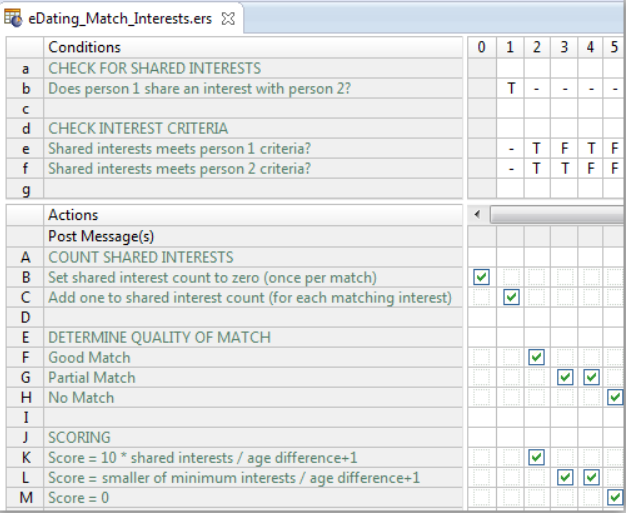
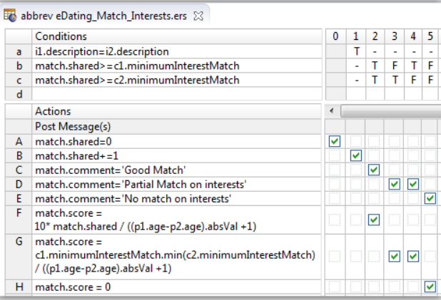
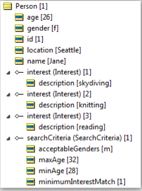
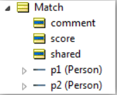
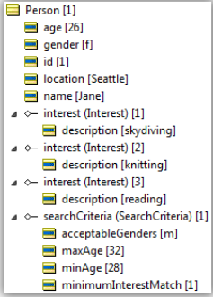
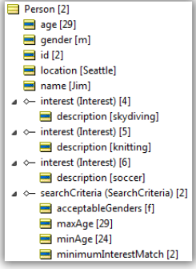
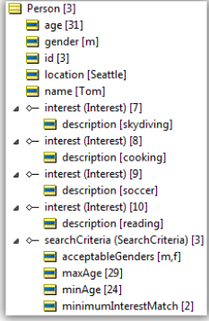
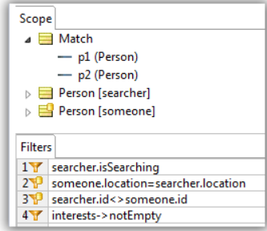

# Online Dating Matchmaker
Rules to match dating preferences 

## Challenge Prompt:

Consider the following situation. You have been approached by an online dating service that wants to
use a rules engine to improve its process for matching people.
Below is a brief explanation of the “business logic” behind their online dating services:
- Each person creates a profile defining their preferences.
- The rules check the profiles to determine all the possible matches for a person.
- The matches are scored. Higher scores indicate a better match.
- Scoring (once the matching criteria are met) is based on the age difference and the number of matching interests.

Each profile includes:

1. Name
2. Gender
3. City
4. Age
5. List of interests
6. Minimum and Maximum acceptable age
7. Acceptable genders
8. Minimum number of matching interests.
   
And here are the rules (applied to both persons):

1. Gender of the other person must be one of the acceptable genders
2. Age of the other person must be within the acceptable range
3. City must match exactly
4. Matching interests of the other person must match at least the number specified
They even provided an example of a compatible match:
Jane (age 26, lives in Seattle, interests are skydiving, knitting, reading) is looking for a male 
age 28-32
with at least one of those interests
Jim (age 29, lives in Seattle, interests are skydiving, soccer, knitting) is looking for a female 
age 24-29
with at least two of those interests
Note that the rules must apply both ways between the two people

## The Process


1. Step 1 will try all possible pairs of people to see which ones match on location, age and gender. When two matching people are found, a possible match record will be created that refers to the two people.
2. Step 2 will examine each of the possible match records from step 1, calculate the number of shared interests and check that they are acceptable to both people. A score will also be calculated based on the number of shared interests and the age difference. A larger score means a better match.
3. Step 3 sorts the matches (best first) and generates a simple report

### A Possible Scoring Algorithm

1. If both minimum interests are met then score = 10* number of shared interests / (age difference+1) [avoids division by zero]
2. If only one minimum is met then score = smaller minimum / (age difference+1)
3. If neither minimum then score = 0
   
Depending on whether age difference or number of interests was the more important factor you might change this formula.

### Match Persons Based on Location, Age and Gender


_Natural language representation (effectively a specification)_

A possible implementation where `criteria1` and 2 refer to the selection criteria for person1 and 2.


Rule statements that generate audit trail messages might look like this:


Attributes enclosed in {} will be replaced by actual values at run time.

### Match Interests and Calculate a Score





### The Vocabulary

The data passed to the rules will be in this form:



The rules will apply the matching logic and create
instances of Match where appropriate:



### Commentary on the Data Model
Some of the other vendor solutions use a flattened data structure. For example the attributes of the Criteria object could be defined at the Person level. This works fine as long as you only want to allow a
person to have a single search criteria record. If you define the data structure as a one to many association between Person and Criteria then you allow someone to have many different searches, possibly in different locations (without any change to the rule model).

Similarly, interests can be flattened as an attribute of Person. But then you are faced with a more complex problem of parsing the string which contains the various free-form interests with some sort of delimiter.

In contrast we can easily do this with gender since there are (in this model) only two genders (m,f) to deal with. This enables us to use the “contains” operator in this syntax:

```
criteria1.acceptableGenders.contains(person2.gender)
```
This works providing gender is constrained to be m or f. If the person was allowed to enter a word like “female” then this would match both m and f.

In this model all the interests are given equal weight. But it’s possible to allow a person to attach more significance to certain interests simply by adding a “weight” attribute to the Interest object. 
This is something that’s harder to do with the flattened data model.

### Test Cases





This has Jane and Jim from the challenge description, but we’ve also added Tom (age 31) to show how the scoring works. The rules produce these conclusions:


Jane-Tom gets a lower score (3.33) than Jane-Jim (5.0) because of the greater difference in ages.

### Variations and Enhancements

The model currently requires all the persons that are to be considered for matching to be in memory. If we had millions of people this could be a problem. And it might take a long time to try every pair.

One simple solution is to modify the Corticon rule sheet that does the matching on location, age and gender to load only the relevant person data from a database based on location (and possibly age). This
would reduce the number of candidates for the matching considerably.

We’d send a single person to the rules (the “searcher”) and based on that would load potential mates (“searchees”) that would then be processed by the other rules. This is most likely how it would work if
we were using an iPhone app as the user interface for the search. The searcher’s details would be sent to Corticon on the server and a list of potential matches would be sent back. Configured in this 
manner the Corticon server could support hundreds or thousands of searches simply by allocating more CPUs to the server as needed.

The only changes to the original rule model required to convert to a database solution are as follows:
1. Create a database schema to match the vocabulary (Corticon can do this automatically)
2. Modify the scope and filters on the Person matching rule sheet to accommodate database
access
3. Run the rules with database access set to READ or READ/UPDATE

Here’s what the modified scope and filter would look like:



Notice that the Person with the little disk icon is the “someone” being searched for in the database whereas the Person designated “searcher” is the one that was passed into
the rules to drive the search. The filters with the disk icon show that the query is processed on the database side.

The rules themselves don’t need to change (they don’t care about or need to know the source of the data) except for using
a different alias to the Person object to distinguish the searcher from someone being searched. So now instead of comparing NxN pairs of people, we only need to compare X (where X << N; X is the size of the set with location matching the searcher).

