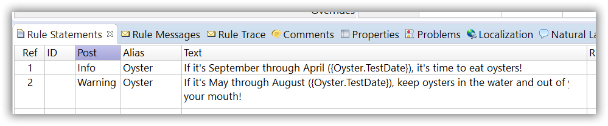
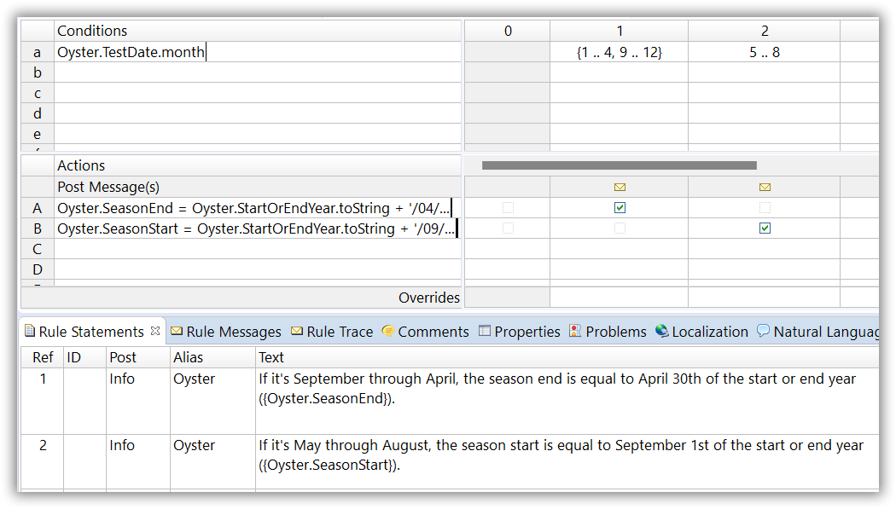
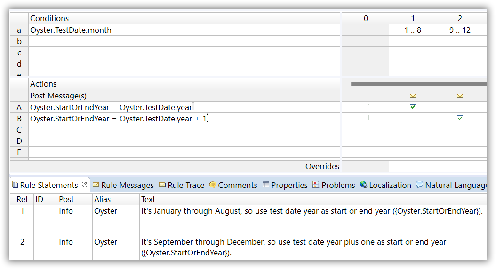
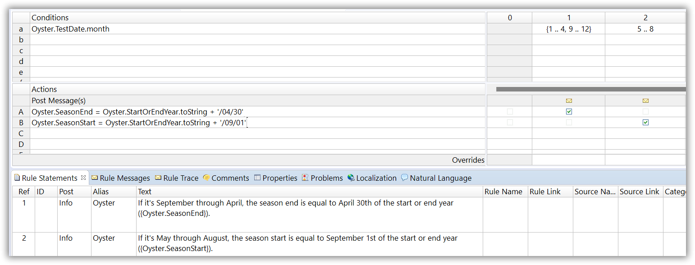
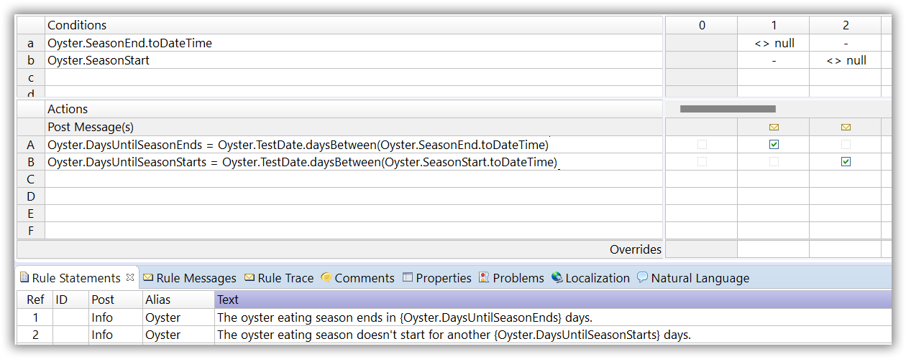
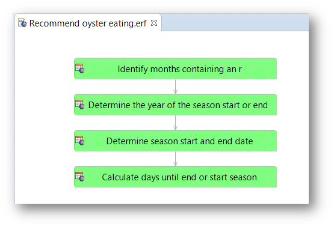
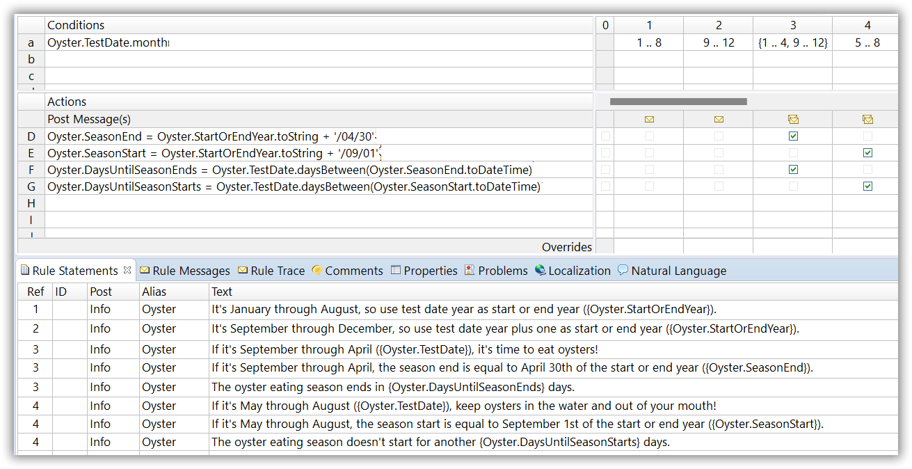
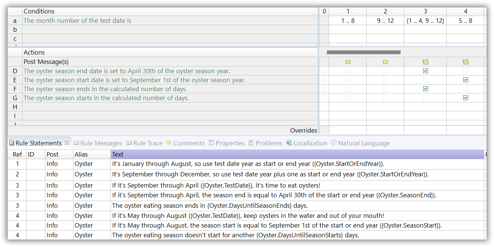
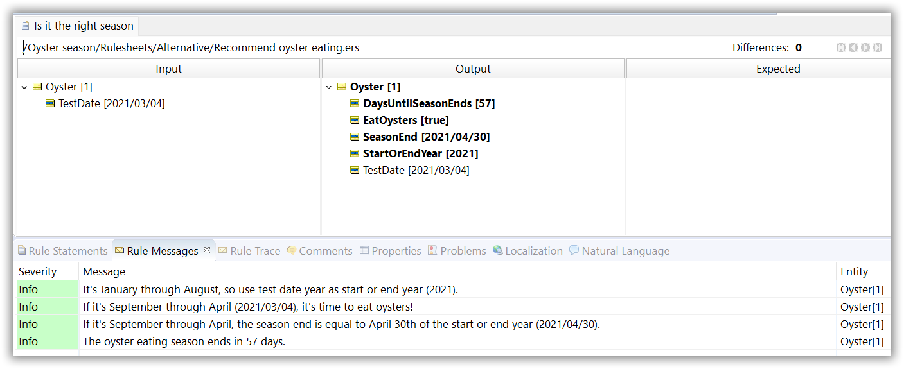

# Oyster Season

Aficionados believe that raw oysters are best eaten during months that end with an “r” because colder water temperatures in the winter contribute to tastier and healthier shellfish. To help maximize the oystermen’s time, please build a Corticon rules project that tests any given date to determine whether oysters should be harvested. When they should not be harvested, please define a rule stipulating how many days must pass before eating season begins. Or, if eating season is already in progress, how much longer will the season last?

#  The Solution
There are two pieces to this puzzle:
1. identifying those months containing an “r” in their names, and
2. calculating the number of days between the date to be tested (let’s call it `TestDate`) and the beginning or end of oyster season.
To start, we’ll look at each component individually; we will combine them at the end. 
	
## Step 1: Identifying those months containing an “r”

We start with the first rulesheet to tackle the first piece related to the month of harvest. To make our lives more straightforward as rule modelers, we start with our rule messages. Notice the TestDate which we inserted from the vocabulary in the statement to contextualize the produced rule messages once we start testing this with some real data.

We can even take this one step further, by starting with natural language text for our conditions and actions. We can open the Natural Language view as follows and drag the pane next to our rule statement pane.

Now we can enter the plain language text for our rules’ conditions and actions!

Let’s now define the rules.

In the Rulesheet above, our `TestDate` is a ‘Date’ attribute, and we use the `.month`
operator to identify the integer number of the month. The 1st rule column tests if the month number falls within the range 1..4 (representing the months January through April) or 9..12 (September through December) – these two ranges, taken together, cover the entire oyster-eating season. 

The 2nd rule column tests if the month number falls within the range 5..8 (May through August) – the range covering non-oyster-eating season. We’re working from a Date—no matter what the format (mask) of the ‘Date’ information is, the `.month` operator will always extract the month as an integer.

## Step 2: Calculate the number of days between TestDate and the beginning or end of oyster season.

The tricky part about calculating the season’s start date (if currently out-of-season) or the end (if currently in-season) is determining the correct year. If `TestDate` is March 1 (which is in-season) then the season end date occurs on April 30 of the same year. However, if the `TestDate` is October 1 (also in-season), then the end date is April 30 of the following year! 

We’ll break our solution into two parts:

1.	The first determines the year of the season start or end (as appropriate). 
2.	The second will calculate the number of days between the start or end date and the TestDate.

### 2.1 Determine the year of the season start or end (as appropriate).

The Rulesheet above shows a simple way to determine the start or end year based on the month of `TestDate`. If `TestDate.month` is January through April, which is in-season, then the season ends in the same year (May 1). If `TestDate.month` is May through August, which is out-of-season, then the next season starts in the same year (September 1). However, if `TestDate.month` is September through December, which is in-season, then the season ends next year (May 1).

After determining the year of the start of the next season or end of the current season (depending on the time of season `TestDate` is in), the next step is to put together a complete date value.

### 2.2 Calculate the number of days between the start or end date and the `TestDate`.

The screenshot above shows a brute-force approach to producing an actual date value for `SeasonEnd` or `SeasonStart` as appropriate. Note that the result of these rules is a String attribute that contains text that looks like a date but isn’t actually `Date` information…yet. 

We’ll worry about the conversion into an actual `Date` in the next step.

Finally, with a `TestDate` and either a `SeasonEnd` date or `SeasonStart` date, we can calculate the time (number of days) between them:

The Rulesheet above shows two conditional rules that use the **.daysBetween** operator to calculate the number of days between `TestDate` and either 1) the start of the next season or 2) the end of the current season. Both rules are conditional, so only the one which has enough data to work with will actually fire.

For example, if `TestDate` is May 1, 2021, then only `SeasonStart` is calculated above, causing only Conditional rule 2 to fire – `SeasonEnd` was not calculated and does not exist. Thus, conditional rule 1’s condition is not satisfied and hence its corresponding action will not fire.

Through our step by step approach, we have completed the rules and we can package them in a ruleflow which we can publish to Corticon Server as an executable decision service.

Alternatively, the four steps shown above could be combined into a single Rulesheet – the dependencies between rules will still be understood and executed correctly by Studio. Here’s a screenshot of the combined rules in a single Rulesheet:

Or in natural text format:

As long as your rules are easily maintainable and understood by your business audience, you could take the step to step approach or consolidate all rules into one rulesheet. So next time you’re not sure whether it is oyster eating season, just consult your decision service (through Corticon Tester). You can call your consolidated rules rulesheet:

As always, the full solution can be downloaded from the [Corticon GitHub repository](https://github.com/corticon/newsletter-solutions). 