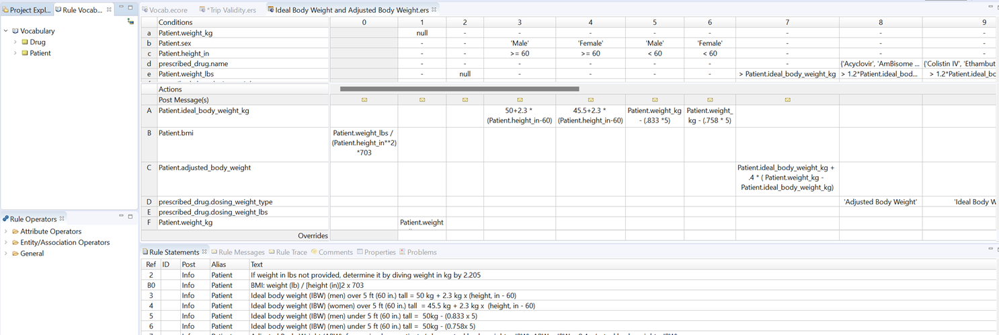
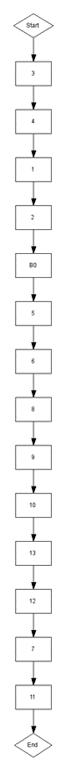
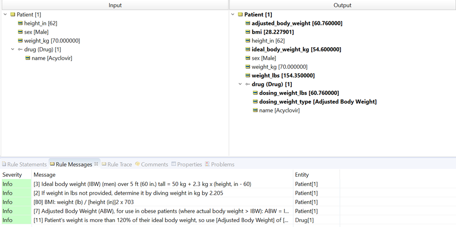
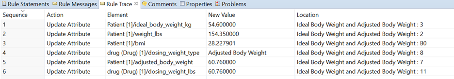
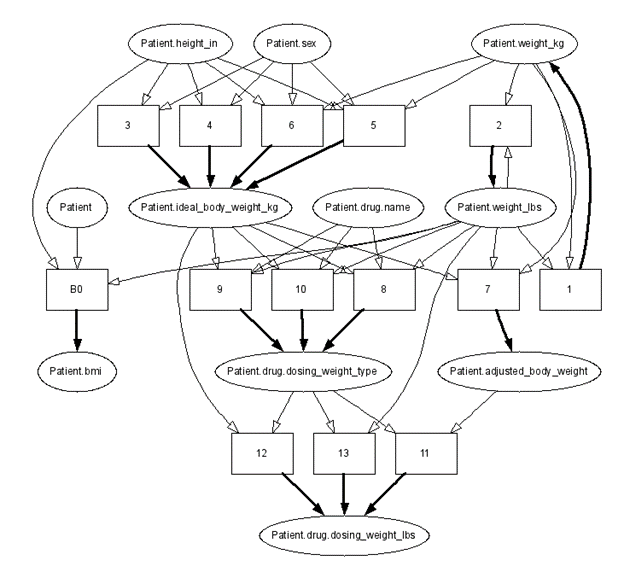

Based upon patient attributes, calculate recommended medication dose.

---

[Download Rule Assets
](https://minhaskamal.github.io/DownGit/#/home?url=https://github.com/corticon/templates/blob/main/classic-templates/project-zips/Dosing%20Weights.zip)

---
Certain drugs are prescribed based upon a patient’s weight, but the prescriber must also consider whether the patient is overweight or underweight. When a patient is within the bounds of a clinically healthy weight, then that weight will serve as the input for calculating an appropriate dosage.

If a patient is 20-30% above their ideal body weight, then this input is adjusted—for some medications, instead of the patient’s actual weight, an adjusted body weight is calculated. For other medications, their ideal body weight is used.

In a Corticon rulesheet, we can implement all the necessary dosage guidances based upon their weight, sex, height and prescribed medication.

If we open the execution sequence diagram, we see how Corticon will evaluate data against these rules, using the default inferencing mechanism in Corticon called “Optimized Inferencing.”

Optimized Inferencing processing is a powerful capability that enables the rule modeler to “break up” complex logic into a series of smaller, less complex rules. Once broken up into smaller or simpler rules, the logic will be executed in the proper sequence automatically, based on the dependencies determined by the compiler.

An important characteristic of Optimized Inferencing processing: the flow of rule execution is single pass, meaning a rule in the sequence is evaluated once and never revisited, even if the data values (or data “state”) evaluated by its Conditions change over the course of rule execution. These rules are perfectly handled with the default Optimized Inferencing option.

When we test this rule sheet using the test case of a male patient who is 62 in. tall, 70 kg, with a prescription for Acyclovir, the order of execution of the rules is determined by Corticon based upon the logical dependencies between the rules.

Opening the Rule Trace panel, we see the order of the executed rules was rule #3, rule #2, rule #B0, rule #8, rule #7 and finally rule #11.

We can see how Corticon has made these inferencing decisions by viewing the logical dependency graph.

