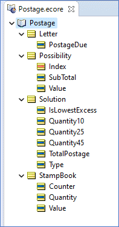
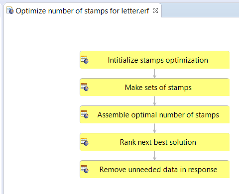
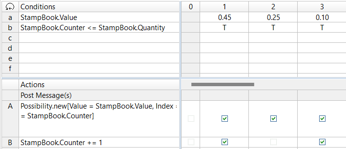
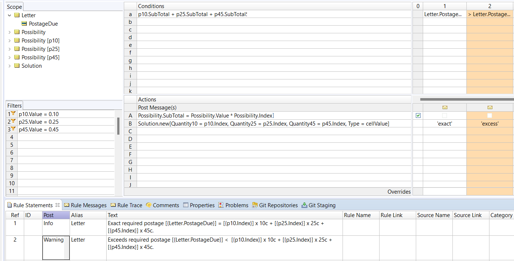
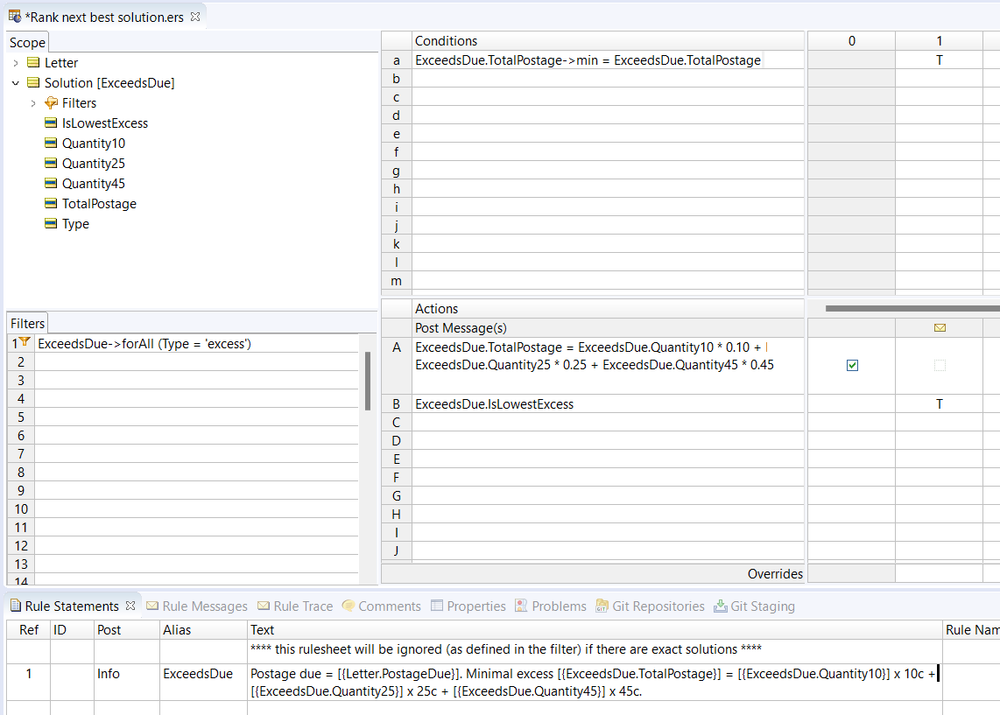
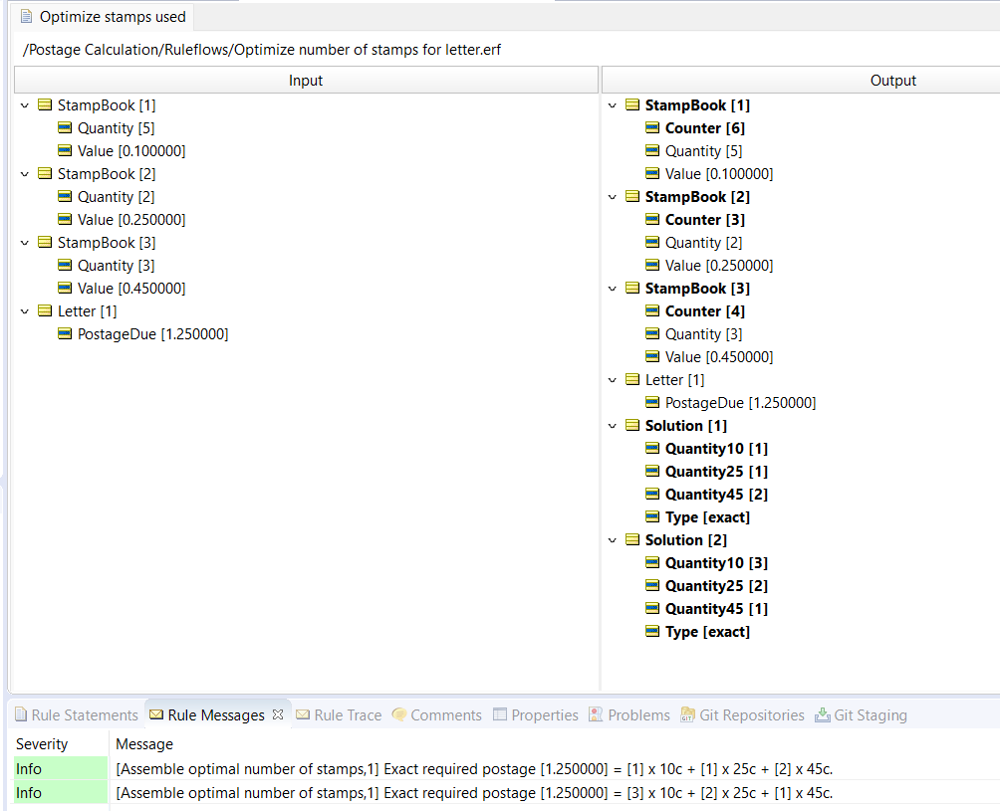
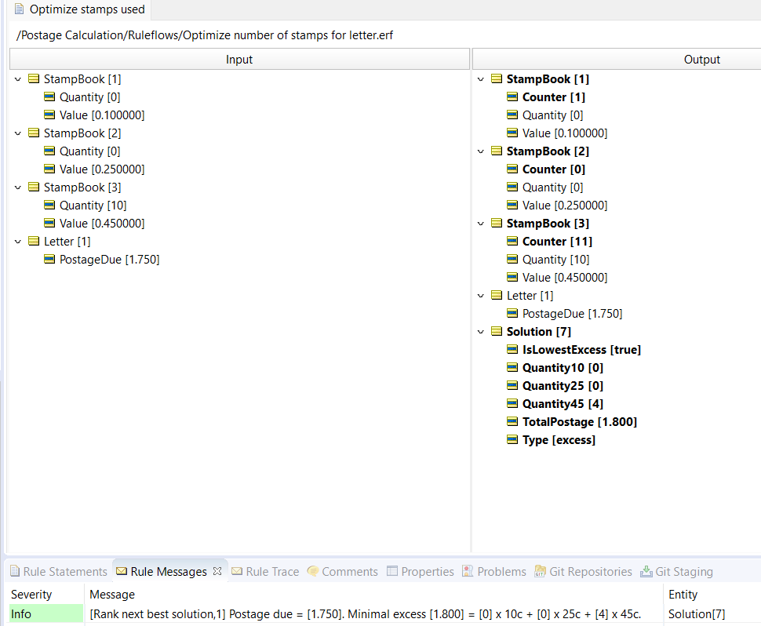

Which combination of stamps is optimal?

---

[Download Rule Assets](https://minhaskamal.github.io/DownGit/#/home?url=https://github.com/corticon/templates/blob/main/classic-templates/Postage-Calculation/Postage%20Calculation.zip)

---
Assume you need to mail a letter and the required postage costs (an arbitrary) 1.25 (whatever currency). The Post Office prints stamps in 45, 25, and 10‐cent increments. What combination of stamps is needed to total 1.25? If it’s not possible to total 1.25 exactly, which combination of stamps results in the least amount of wasted, excess postage?

To make this puzzle a little easier to solve, let’s assume that we already have a few stamps (of various values), and simply want to choose the most efficient combination.

This is a constraint‐based problem, with a little optimization thrown in for good measure. To rephrase the question, “Given our stamps on hand, how can we assemble the necessary postage with minimal excess?”

--- 

At the heart of these types of problems is the notion of dealing with many possible combinations of things: first, assembling them and second, testing them to see if any fit our constraints. In this example, we have several different stamps, and therefore many different combinations of those stamps which sum to different amounts. To understand better the math underlying these combinations, let’s look at a simplified example.

Assume we have 2 stamps, one of value A and one of value B. How many combinations of these two stamps are possible? We can have {1A+1B, 1A+0B, 0A+1B, and 0A+0B}. That last combination, 0A+0B, isn’t very useful to us, but mathematically, it’s still a valid combination. So 2 stamps gives us 4 possible combinations. What if we have 2 As and 1 B? Our combinations are {2A+1B, 2A+0B, 1A+1B, 1A+0B, 0A+1B, 0A+0B} or 6 total combinations. It turns out that our combinations can be calculated as (#A+1)*(#B+1). This is the defining algorithm for the puzzle. 

But we also need to recognize that knowing the number of combinations isn’t sufficient ‐ we will need to create an example of each of these possible combinations for testing with our constraint. In other words, we need to check each combination to see if it adds up to 1.25, which is the postage required to send the letter.

Having a feel for the algorithm involved is important because it influences the Vocabulary model. We know we’re going to need to work with collections of stamps and of possible combinations. And we know that some of these combinations will result in valid solutions, i.e. combinations that satisfy the constraint, and some will not. We’ll need a way to indicate this difference.

---

Let’s create a Vocabulary that incorporates some of these requirements: 

The Vocabulary contains a `Letter` entity and its `PostageDue` attribute which will hold the 1.25 value we’re using as the problem’s constraint.

We’ll use the `StampBook` entity to represent the set or number of stamps having the same value.

A `Possibility` entity will represent a possible multiple of each type of stamp. In the simple example earlier, possibilities would exist for 2A, 1A, 0A, 1B, and 0B. The `Index` attribute holds the “2” while value holds the “A”. We’ll use `Subtotal` to hold the product of the other two attributes, which in our case, using 45, 25, or 10 cents rather than A or B as stamp values, will be a number.

Finally, the `Solution` entity is where the “rubber meets the road”. We’ll create solutions as combinations of possibilities. For example, 2A+1B represents a combination of two possibilities, 2A and 1B. Because we know the subtotal of each possibility, we can calculate the `TotalPostage` of each `Solution`. That’s the value we’ll compare to the `Letter.PostageDue` value.

In each `Solution`, the attributes `Quantity45`, `Quantity25`, and `Quantity10` attributes will hold the numbers of each type of stamp, where `Quantity45` represents the quantity of 45‐cent stamps, etc. The `Type` attribute will have one of three values: `exact`, `excess`, or `insufficient` to indicate how each solution compares to the constraint. And the `LowestExcess` attribute is a boolean flag we’ll use to mark those solutions whose `TotalPostage` exceeds the constraint by the smallest amount.

The Ruleflow below contains a total of 5 Rulesheets, but only the middle 3 are instructive. The first and last Rulesheets contain simple “housekeeping” rules that set up and clean up the results. We’ll leave those Rulesheets for your download and review.

The first Rulesheet we’ll discuss here is the second one in the Ruleflow, named Make sets of stamps. As its name implies, here’s where `Possibility` entities will be generated based on the stamps we have on hand:

According to the algorithm discussed previously, if we have three 45‐cent stamps, then we need four (3+1) possibilities because we have the option of using {3,2,1,0} 45‐cent stamps on our letter. Follow the logic in rule 1: If we have any 45‐cent stamps on hand, then one of the `StampBook` entities will have a `value` attribute equal to 0.45.

As long as its `counter` attribute is less than the `StampBook`’s number of 45‐cent stamps, we create a new `Possibility` and increment the Counter. Because this Rulesheet is processed iteratively (self-triggered), the rule will fire repeatedly until {number+1} possibilities have been created ‐ exactly as required by the algorithm. Rule 2 and 3 do the same thing for the 25‐ and 10‐cent stamps.

> You can read more about a single rule that successively revisits, or triggers itself in the [Corticon documentation](https://docs.progress.com/bundle/corticon-rule-modeling/page/Types-of-loops.html?labelkey=product_corticon).

Now that our rules have created lots of possibilities, we need to compare the sum of their `SubTotal` with the constraint. If a combination of possibilities either matches or exceeds the `PostageDue`, then we have a solution of interest. In the 'Assemble optimal number of stamps' Rulesheet below, the whole set of all possibilities has been filtered into individual p45, p25, and p10 subsets so that the sum in Condition row a uses only a single possibility from each subset. 

But, and here’s where we take advantage of the power of Corticon’s declarative approach, the Condition _will automatically evaluate every combination of our possibilities._

Going back to our simplified example, this means that if we have 3 possibilities for stamp A {0,1,2} and 2 possibilities for stamp B {0,1}, then the Condition in row 1 will evaluate 6 times (3x2) automatically!

When an exact match is found, i.e., the sum of the subtotals equals `PostageDue`, then we create a new `Solution`, carrying over the stamp quantities from each Possibility and marking the solution as exact. When the sum of the subtotals exceeds the `PostageDue`, then we also create a `Solution` (because we may still be interested in these solutions if no exact matches are found) but mark it as excess. The Rulesheet may also contains a third rule that fires when the sum of the subtotals is less than `PostageDue`: but those combinations are not interesting to us, so we ignored them in the solution.

Note the used **cellValue** operator in action row B. The special operator cellValue often helps to reduce the number of Action rows required to express your rules. If we hadn’t used cellValue in Action row 1, we would have needed 2 additional Action rows to express the logic for rule columns 2 and (not modeled) rule 3. For more examples of cellValue, see the [Rule Language Guide](https://docs.progress.com/bundle/corticon-js-rule-language/page/CellValue.html).

The 'Rank next best solution' Rulesheet identifies the next‐best solution if no exact matches are found. And by “next‐best”, we mean the solution that uses the least amount of excess postage.

Due to the Precondition/Filter, this Rulesheet will only execute if all the solutions are excess. If any of them are exact, then we’re not really interested in finding a next‐best solution ‐ we’ll use the exact solution(s) ‐ and this Rulesheet is skipped.

The Nonconditional rule is straightforward ‐ it calculates the `TotalPostage` amount for each excess solution.

The Condition in row a compares the lowest `TotalPostage` in the set of excess solutions to all `TotalPostage` values in the set. Why do this? Because there may be more than one `Solution` with lowest `TotalPostage`, and we want to identify all of them. Each solution will use a unique combination of stamps, and you may prefer to use your larger valued stamps first ‐ this aspect isn’t part of the puzzle, but we like to keep our options open…

When the solution with least excess postage is identified, a **Rule Statement** is also posted.

Let’s test our Ruleflow with a Studio Test. In the Testsheet below, we’ve given ourselves three 45‐cent, two 25‐cent, and five 10‐cent stamps to work with. The required postage to mail the letter is 1.25.

The 'Results' Testsheet tells us that there are two different ways to create exactly 1.25 postage from stamps on hand. There’s no need to look for any next‐best solutions.

A different set of stamps on hand, or a different `PostageDue` constraint, will produce different solutions. Below, we limited ourselves to only 45‐cent stamps to try to make 1.75: The Output in the Testsheet tells us that there is one (less optimal) way to create 1.75 postage from stamps on hand. 

The solution consist of four 45‐cent stamps, is as close as we can come to the 1.75 required, using excess postage of 5 cents.

