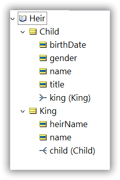
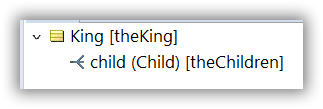
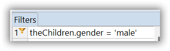
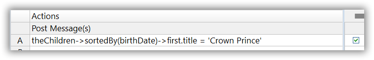
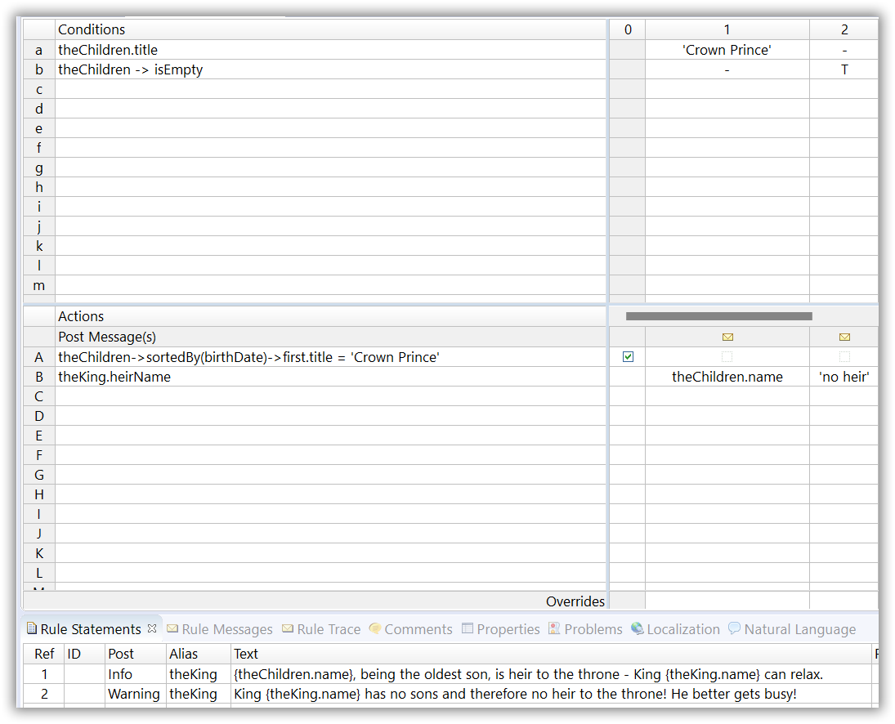
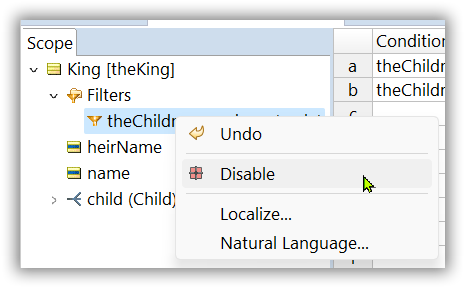
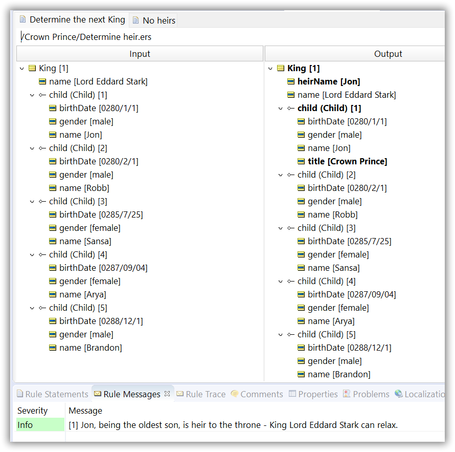

# Heir to the Throne
Which child is the crown prince?
 ---
[Download Rule Assets](https://minhaskamal.github.io/DownGit/#/home?url=https://github.com/corticon/templates/blob/main/classic-templates/Who-is-Heir-to-throne/Solve%20for%20the%20Heir%20to%20the%20Throne.zip)
---
A King may have several children, but only the first-born son is designated “heir” to the throne. Create a rules project which determines which of his children is the “Crown Prince” and heir to the throne.

As usual, there is more than one way to solve this problem: for example, we had a submission (we had a good laugh!) in which the author incorporated rules to check for misattributed paternity of children based on blood type matching. Very creative, well done!

That said, most solutions have a few things in common. In general, they recognize:

- That this problem deals with ollections, specifically the collection of children associated with the King. In more natural language, it’s just the collection of the King’s children. This recognition provides some guidance for building a simple vocabulary that supports our rules.
- That our rules must operate on a certain subset of children, specifically, the males. This implies we’ll need to “filter out” the females. Note, we’re not judging the sexism inherent in patriarchal/monarchical systems, we’re just trying to solve the problem… 
- 

- The need to sort the remaining children according to age and identify the oldest – in other words, the oldest of the males.

Anytime we suspect that a rule may deal with collections, we need to ensure our Vocabulary supports the creation and manipulation of collections. By this, we usually mean the presence of at least two entities joined by an association of one-to-many cardinality. When building a Vocabulary from scratch for modeling purposes, it’s easy to ensure this structure exists.

In the sample Vocabulary named **Heir.ecore** to the right, we have a simple structure of two entities, King and Child, linked by a one-to-many association. This allows a King to have multiple associated Child entities, which is appropriate given the problem’s primary assumption – that the King may have more than one child.

Also, note the attributes present in this Vocabulary. We know from the problem statement that terms such as “first-born” (implying some concept of age measurement) and “son” (implying some concept of gender classification) are key parts of the logic and need to be represented somehow in the Vocabulary if they are to be included in the business rule model. Here, these concepts are modeled as the attributes **birthDate** and **gender**, respectively. Other terms such as **name** and **title** are less critical and serve here more as conveniences than as mandatory parts of the Vocabulary.

With our supporting Vocabulary in place, we can begin to model our rules. Knowing that collections are unavoidable, we immediately set up a collection alias in the Scope section of the Rulesheet. This gives us a convenient way to refer to the collection (here named **theChildren**). It also allows us to use collection operators in our rules.

With the collection alias defined, our next step is to filter the collection for males. In other words, we want to remove any female children from the collection since only males are eligible to be heir. A conditional expression that acts as a filter is shown below:

Only those children that satisfy this gender test (the males) will survive the filter and be evaluated by other rules in the Rulesheet.

The Nonconditional rule of the Rulesheet contains the sorting logic:

In plain language, this expression says “using the collection named **theChildren**, sort the children in ascending order according to **birthDate**, then assign to the first child the title of **Crown Prince**”.

There are two collection operations in use here, a collection and a sequence operator:

- **sortedBy** sequences the children according to the **birthDate** attribute and
- **first** sequences the children according to the **birthDate** attribute and points to the first child in the ordered set. Assigning the value of **Crown Prince** to the first son’s **title** attribute is how we’ve chosen to designate or mark the King’s heir.

**Sorting is one of the more sophisticated actions you can take on your collections. Learn more about it** [**here**](https://docs.progress.com/bundle/corticon-rule-modeling/page/Collections.html?labelkey=product_corticon "https://docs.progress.com/bundle/corticon-rule-modeling/page/Collections.html?labelkey=product_corticon")**.**

Finally, a few Condition/Action rules round out our Rulesheet and provide a convenient way to post informative messages.

Rule 1 (column 1) is straightforward – the son designated Crown Prince by the Nonconditional rule will cause this rule to fire, simply posting a message and assigning his name to the King’s **heirName** attribute.

Rule 2 (column 2) is a bit more interesting. Because it’s possible for a King to have no sons or even no children at all, we decided to test for the emptiness of the filtered collection **theChildren** using the **isEmpt**y operator. A warning message is appropriate since a childless King wishing to preserve his lineage needs to get his priorities in order!

**But wait!** Our filter filters all (related) male children, but if no children survive the filter, the King himself gets filtered out as well. We call that a full filter, which is the default filter in Corticon. So, if we want to check for ‘no children' or more accurately no male children (rule 2), we need to disable the filter which was applied to the King by default. We need to apply a limited filter.  

To turn a Filter expression into a limiting filter, right-click on a filter in the scope section and select Disable from the menu, as shown.

**To learn more and** [**limited filters**](https://docs.progress.com/bundle/corticon-js-rule-modeling/page/Limiting-filters.html?labelkey=product_corticon "https://docs.progress.com/bundle/corticon-js-rule-modeling/page/Limiting-filters.html?labelkey=product_corticon")**, read the excellent documentation on this topic.**

Fortunately, as you can see below, our Kingdom is preserved in this Studio Testsheet:

The full solution can be downloaded from [here](https://minhaskamal.github.io/DownGit/#/home?url=https://github.com/corticon/newsletter-solutions/tree/main/NewsletterPuzzleSolutionFall2021&fileName=CrownPrince&rootDirectory=<true>).
