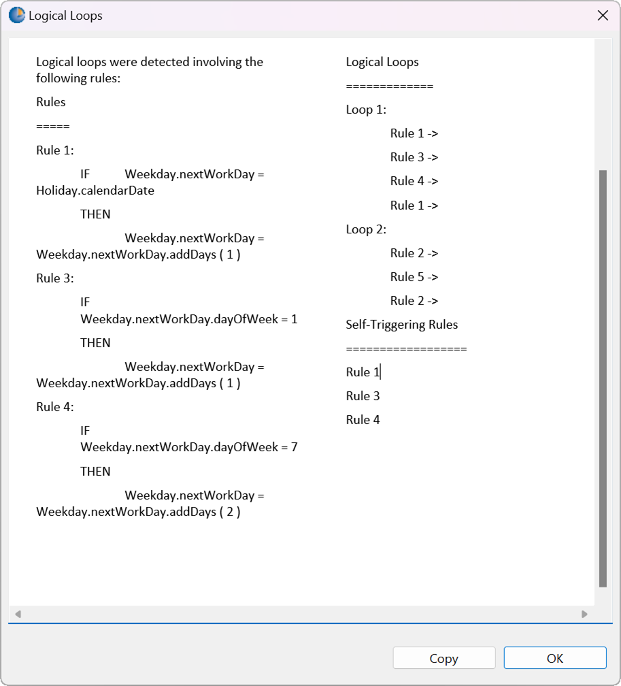
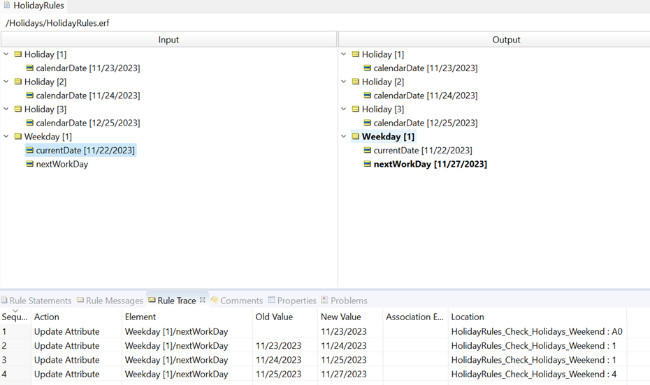

# Holidays - Use Case for Advanced Inferencing w. Self Triggering
---

[Download Rule Assets](https://minhaskamal.github.io/DownGit/#/home?url=https://github.com/corticon/templates/blob/main/classic-templates/Working-Days/Holidays%20-%20Use%20Case%20for%20Advanced%20Inferencing%20w.%20Self%20Triggering.zip)

* Use with Corticon classic? ✅
* Use with Corticon.js? ❌

---

Advanced Inferencing with Self-Triggering is needed when the conditions of a rule may be changed by its own actions (or the actions of another rule) and that rule must be reevaluated when the values change. Independent rules will not be re-evaluated when using Advanced Inferencing. Independent rules will be re-evaluated when using Advanced Inferencing with self-triggering and the rule depends logically on themselves.

For example, consider a set of workforce management rules which must plan into advance scheduling for a project across multiple workdays. The rules must assign a specified number of workdays for the project but consider both weekends and holidays. 
The rules in this rulesheet do the following—
- Set the attribute Weekday.nextWorkDay to today’s date + 1 by default, in the action only zero column
- If that next workday is a holiday, then again add 1 to the next workday date
- If the next workday’s day of week = 1 (Sunday), then add 1 to the next workday date
- If the next workday’s day of week = 7 (Saturday), then add 2 to the next workday date

When we run the logical loop test upon these rules, we see several reported:

This window first identifies exactly which rules are involved in loops. Secondly, the window outlines the specific attribute interactions that create the loops.
When Weekday.nextWorkDay is a weekend day or holiday, then rules 1 or 4 fire to increment the next workday’s day of week. Data state has now changed, in other words, the value of at least one of the attributes has changed. 
Because it was also rule 1 or 4’s execution that caused the data state change, and since self-triggering is enabled, the same rules 1 and 4 will be reevaluated until the day of the week is not 1 or 7 and is not a holiday. 
We can see this in action by defining a ruletest like that shown below. The calendar dates of holidays are defined as November 23, November 24, and December 25 of 2023. When the weekday to be evaluated is November 22, 2023, then the value of the attribute Weekday.nextWorkDay is evaluated 3 times to ‘reach’ the right answer of November 27, 2023. 

 
