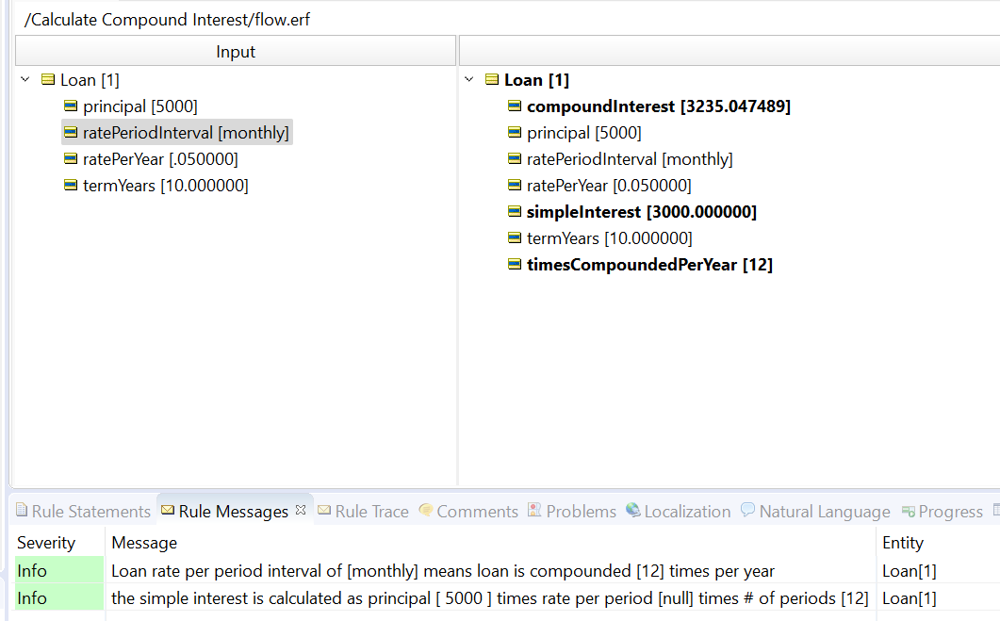

# The Miracle of Compound Interest

Calculate compound interest depending on type of compounding.

---

[Download Rule Assets](https://minhaskamal.github.io/DownGit/#/home?url=https://github.com/corticon/templates/blob/main/classic-templates/Calculate-Compound-Interest/Calculate%20Compound%20Interest.zip)
* Use with Corticon classic? ✅
* Use with Corticon.js? ✅
---

With these rules you can calculate what the value of X dollars will be in the future using various bank interest scenarios:
- Simple or Compound Interest
- If Compound, then over what frequency schedule: daily, monthly, annually?

